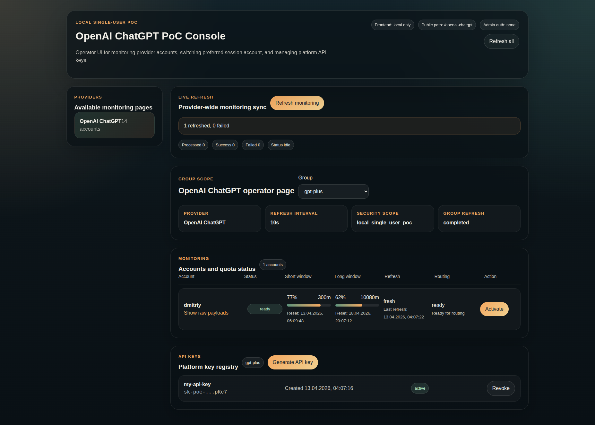

# LLM Agent Platform

**LLM Agent Platform** — provider-centric платформа для LLM-агентов и developer tools с единым OpenAI-compatible API, operator/admin UI и отдельным identity boundary для login и JWT.

---



## Что уже materialized

Платформа в текущем mini-release уже включает 3 runtime-сервиса:

- `services/backend` — machine-facing provider API и admin backend runtime;
- `services/frontend` — local operator/admin UI;
- `services/user_service` — identity service для login, JWT issuance и user storage.

Текущий baseline уже покрывает:

- provider-scoped OpenAI-compatible маршруты `/<provider_name>/v1/*` и `/<provider_name>/<group_name>/v1/*`;
- provider-local routing и account groups;
- platform API keys для public `openai-chatgpt` surface;
- login flow через `user_service` и JWT guard для `/admin/*`;
- protected operator/admin frontend shell;
- service-wide health-check contour.

## Ключевые свойства платформы

1. **Provider-centric OpenAI-compatible API**
   - provider выбирается через URL namespace;
   - одинаковые `model_id` у разных providers не конфликтуют.

2. **Provider-local routing**
   - группы аккаунтов живут внутри provider namespace;
   - текущий baseline балансировки строится внутри `(provider_id, group_id)`.

3. **Разделенные auth boundaries**
   - public provider surface использует platform API keys;
   - admin surface использует JWT через `user_service`.

4. **Operator/admin UI**
   - frontend читает backend admin API;
   - login и protected shell уже materialized в текущем mini-release.

5. **Каноническая документация и contracts**
   - архитектура живет в `docs/architecture/`;
   - contracts живут в `docs/contracts/`;
   - provider-specific особенности индексируются в `docs/providers/`.

## Архитектурная модель

Текущий system shape состоит из трех service boundaries:

- `Frontend service`
- `Backend service`
- `User service`

High-level взаимодействие:

- человек логинится через `Frontend service`;
- `Frontend service` ходит в `User service` за login/JWT;
- `Frontend service` ходит в `Backend service` за admin API;
- внешние агенты и developer tools ходят напрямую в `Backend service` через OpenAI-compatible API.

Подробности:

- [`docs/services/index.md`](docs/services/index.md:1)
- [`docs/architecture/system-overview.md`](docs/architecture/system-overview.md:1)
- [`docs/architecture/container-view.md`](docs/architecture/container-view.md:1)
- [`docs/architecture/openai-chat-completions-pipeline.md`](docs/architecture/openai-chat-completions-pipeline.md:1)

## Быстрый старт

### 1. Подготовка окружения

```bash
cp .env.example .env
```

При локальном auth/admin contour должны быть согласованы как минимум:

- `JWT_SHARED_SECRET`
- `JWT_ISSUER`
- `JWT_ALGORITHM`

### 2. Запуск mini-release контура

Для актуальной локальной сборки с `backend + frontend + user_service + user-db` используйте:

```bash
docker compose -f docker-compose-dev.yml up -d --build
```

### 3. Применение миграций `user_service`

Если база данных поднимается впервые:

```bash
docker exec user-service-dev uv run alembic upgrade head
```

### 4. Создание operator/admin пользователя

Для текущего baseline backend трактует роль `developer` как `admin` внутри `/admin/*`:

```bash
docker exec user-service-dev uv run python scripts/register_user.py <username> <password> developer
```

### 5. Доступ к сервисам

- frontend: `http://127.0.0.1:4173`
- backend public/admin API: `http://127.0.0.1:4000`
- user_service: `http://127.0.0.1:8010`

## Подключение к IDE и клиентам

### OpenAI Compatible

| Параметр | Значение |
| :--- | :--- |
| **Base URL** | `http://localhost:4000/<provider_name>/v1` |
| **API Key** | platform API key для соответствующего provider/group |
| **Provider** | OpenAI Compatible |

Примеры:

- `http://localhost:4000/gemini-cli/v1`
- `http://localhost:4000/qwen-code/v1`
- `http://localhost:4000/openai-chatgpt/v1`

### Native Gemini

| Параметр | Значение |
| :--- | :--- |
| **Base URL** | `http://localhost:4000` |
| **API Key** | `any-string` |
| **Provider** | Gemini (Google AI Studio / Vertex AI) |

## Авторизация и доступ

### Public provider surface

- `/<provider_name>/v1/*` и `/<provider_name>/<group_name>/v1/*`
- auth через provider/public boundary
- для `openai-chatgpt` materialized platform API key guard

### Admin surface

- `/admin/*`
- login через `POST /auth/login` в `user_service`
- backend проверяет Bearer JWT через shared secret

Подробности:

- [`docs/auth.md`](docs/auth.md:1)
- [`docs/providers/openai-chatgpt.md`](docs/providers/openai-chatgpt.md:1)
- [`docs/architecture/admin-monitoring-read-model.md`](docs/architecture/admin-monitoring-read-model.md:1)

## Health-check и verification baseline

Текущий mini-release уже включает service-wide health contour:

- backend `/health`
- frontend `/health`
- user_service `/health`

Ключевые проверки:

```bash
cd services/backend && uv run python -m unittest llm_agent_platform/tests/test_service_health_checks.py
cd services/backend && uv run python -m unittest llm_agent_platform/tests/test_admin_auth_guard.py
cd services/user_service && uv run pytest tests/test_auth_baseline.py
cd services/frontend && npm run build
```

Полный индекс test suites:

- [`docs/testing/test-map.md`](docs/testing/test-map.md:1)

## Документация

- [`docs/vision.md`](docs/vision.md:1)
- [`docs/auth.md`](docs/auth.md:1)
- [`docs/setup.md`](docs/setup.md:1)
- [`docs/run/index.md`](docs/run/index.md:1)
- [`docs/services/index.md`](docs/services/index.md:1)
- [`docs/architecture/component-map.md`](docs/architecture/component-map.md:1)
- [`docs/providers/index.md`](docs/providers/index.md:1)
- [`docs/providers/openai-chatgpt.md`](docs/providers/openai-chatgpt.md:1)

## Принцип документации

Source of Truth для актуальной архитектуры находится в `docs/`.

`operational_scope/` хранит planning и execution artifacts, но не должен подменять каноническую архитектурную документацию.

---

Проект распространяется под лицензией MIT.
