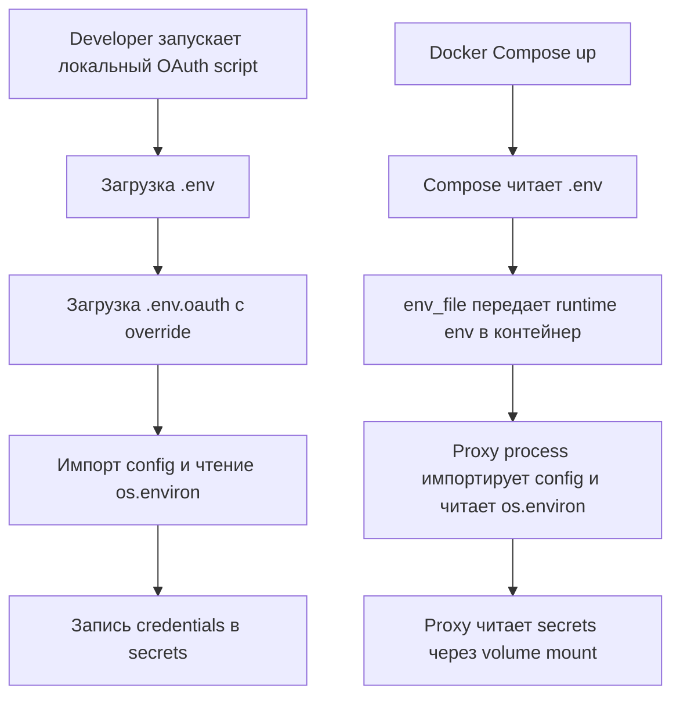

# ADR 0015: Разделение runtime и OAuth bootstrap конфигурации окружения

## Status
Accepted

## Context

В проекте есть два разных рантайма с разными требованиями к конфигурации:

1) **Платформа для LLM-агентов** запускается в контейнере через [`docker-compose.yml`](docker-compose.yml:1) и читает конфигурацию из переменных окружения процесса (см. [`llm_agent_platform/config.py`](llm_agent_platform/config.py:1)).

2) **OAuth bootstrap-скрипты** запускаются локально (вне контейнера) из VS Code/uv, например:
   - [`scripts/get_gemini-cli_credentials.py`](scripts/get_gemini-cli_credentials.py:1)
   - [`scripts/get_qwen-code_credentials.py`](scripts/get_qwen-code_credentials.py:1)

Сейчас:

- [`llm_agent_platform/config.py`](llm_agent_platform/config.py:1) читает значения из `os.environ` и **не загружает** [`.env`](.env:1) автоматически.
- Docker Compose читает [`.env`](.env:1) **для подстановки** значений в compose-файл, а внутрь контейнера попадают только явно заданные переменные (см. `environment:` в [`docker-compose.yml`](docker-compose.yml:14)).

Из-за этого локальные OAuth-скрипты могут не видеть значения, которые пользователь ожидает взять из [`.env`](.env:1), что приводит к ошибке вида:

- проверка наличия [`GEMINI_CLI_CLIENT_ID`](llm_agent_platform/config.py:59) в [`scripts/get_gemini-cli_credentials.py`](scripts/get_gemini-cli_credentials.py:99)

Дополнительно [`.env.example`](.env.example:1) сейчас смешивает runtime-настройки и bootstrap-параметры OAuth, что создаёт ощущение «лишних» переменных и размывает границы ответственности.

## Decision

Принято разделить конфигурацию на два файла:

1) **[`.env`](.env:1)** — *только runtime-конфигурация прокси*.
2) **[`.env.oauth`](.env.oauth:1)** — *только bootstrap-конфигурация для локальных OAuth-скриптов*.

И дополнительно:

- Контейнеру прокси передавать runtime-переменные через `env_file: .env` в [`docker-compose.yml`](docker-compose.yml:1).
- Локальные OAuth-скрипты перед импортом [`llm_agent_platform/config.py`](llm_agent_platform/config.py:1) загружают оба файла:
  - сначала [`.env`](.env:1)
  - затем [`.env.oauth`](.env.oauth:1) с приоритетом (override)

Bootstrap OAuth секреты не должны автоматически попадать внутрь контейнера.

## Options Considered

### Option A: Один файл [`.env`](.env:1) для всего + автозагрузка внутри [`llm_agent_platform/config.py`](llm_agent_platform/config.py:1)
- Плюсы: проще в объяснении.
- Минусы: смешение ответственности, риск утечки OAuth bootstrap параметров в runtime; сложнее контролировать «что именно должно попасть в контейнер».

### Option B: Без изменений в коде, только инструкция запускать скрипты с `source .env`
- Плюсы: без зависимостей.
- Минусы: недетерминированность (VS Code/uv), высокая вероятность регрессий, плохой DX.

### Option C (выбрано): Разделение runtime и OAuth bootstrap
- Плюсы: чёткие границы ответственности; минимизация попадания OAuth bootstrap секретов в контейнер; предсказуемое поведение локальных скриптов и compose.
- Минусы: добавляется второй файл-конфиг и зависимость для загрузки `.env` в локальном рантайме.

## Consequences

### Положительные
- Локальные скрипты получают детерминированную конфигурацию без ручного экспорта env.
- Runtime контейнера получает только нужные переменные, без bootstrap OAuth секретов.
- [`.env.example`](.env.example:1) становится чище: только runtime-настройки.

### Негативные / Риски
- Появляется второй файл-конфиг [`.env.oauth`](.env.oauth:1), который нужно поддерживать и документировать.
- Нужны явные примеры: [`.env.example`](.env.example:1) и новый [`.env.oauth.example`](.env.oauth.example:1).
- Требуется обновить документацию запуска и ожидания по переменным.

## Implementation Notes (non-normative)

- Proxy runtime источники:
  - `env_file: .env` в [`docker-compose.yml`](docker-compose.yml:1)
  - `environment:` остаётся для override-переменных (например, `LOG_DIR` как путь внутри контейнера).
- OAuth bootstrap источники:
  - локальная загрузка [`.env`](.env:1) и [`.env.oauth`](.env.oauth:1) внутри [`scripts/get_gemini-cli_credentials.py`](scripts/get_gemini-cli_credentials.py:1) и [`scripts/get_qwen-code_credentials.py`](scripts/get_qwen-code_credentials.py:1).

## Diagram

