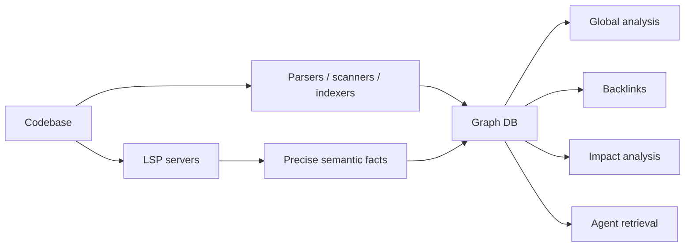

# LSP vs graph database по коду: сильные стороны, ограничения и комбинированный подход

## Кратко

LSP и graph database решают разные классы задач:

- **LSP** лучше подходит для точного semantic analysis внутри конкретного языка
- **Graph database** лучше подходит для глобальных multi-hop queries по всей системе

На практике самый сильный подход — объединять их:

- LSP поставляет precise semantic facts
- graph database хранит и связывает эти факты в project-wide model

## 1. Что такое LSP

LSP означает Language Server Protocol.

Это способ получать semantic information от language-specific server, например:

- TypeScript Server
- Pyright
- gopls
- rust-analyzer
- jdtls
- Markdown language server

### Что LSP умеет хорошо

- go to definition
- find references
- hover
- document symbols
- workspace symbols
- diagnostics
- rename
- autocomplete
- signature help
- type resolution

### Главное преимущество LSP

LSP понимает язык примерно так же, как IDE tooling. Поэтому это обычно самый точный источник ответов на вопросы вида:

- что это за symbol?
- где он defined?
- где он used?
- какой у него type?
- есть ли здесь error?

## 2. Что такое graph database поверх кода

Graph database хранит проект как nodes и edges.

- **Nodes** могут быть:
  - files
  - functions
  - classes
  - modules
  - API endpoints
  - database entities
  - documents
  - tests
  - contracts
- **Edges** могут быть:
  - imports
  - calls
  - defines
  - references
  - reads
  - writes
  - links_to
  - tests
  - implements
  - extends

### Что graph database умеет хорошо

- dependency analysis
- backlinks
- traceability
- impact analysis
- cycle detection
- shortest path
- transitive dependency queries
- multi-hop traversal
- cross-language и cross-artifact analysis

## 3. Преимущества LSP

### Точность

LSP обычно точнее в language semantics:

- types
- signatures
- imports
- namespaces
- resolution rules
- project-config awareness

### Скорость для локальных semantic queries

LSP обычно быстрее для:

- hover
- definition
- references
- diagnostics

Причина в том, что language server оптимизирован для incremental analysis одного языка.

### Editor-oriented workflows

LSP — правильный слой для:

- IDE navigation
- refactoring
- inline diagnostics
- quick fixes

## 4. Ограничения LSP

### Узкий фокус на одном языке за раз

LSP хорошо работает внутри одного языка, но слабее как unified model всей системы.

### Слабая поддержка глобальных multi-hop вопросов

Примеры:

- какие tests покрывают этот contract через несколько шагов?
- какие docs, code и configs связаны с этой feature?
- какие services транзитивно зависят от этого module?

### Нет долговременного project knowledge graph сам по себе

LSP обычно не сохраняет reusable project-wide graph связей.

## 5. Преимущества graph database

### Единая картина системы

Graph database может связать:

- code
- documentation
- tests
- schemas
- API contracts
- infrastructure files
- git metadata
- runtime telemetry

### Сильные query-возможности

Graph database особенно хорош для вопросов вида:

- кто depends on этот component?
- какой path от UI до DB?
- кто ссылается на этот ADR?
- какие tests затрагивает изменение contract?

### Backlinks и reverse navigation

Если нужны:

- inbound links
- reverse dependencies
- transitive impact

graph database обычно подходит лучше, чем LSP.

## 6. Ограничения graph database

### Качество зависит от indexing

Если graph строится только на shallow extraction, он теряет точность.

### Более высокая инфраструктурная стоимость

Нужны:

- ingest pipeline
- schema или graph model
- reindex/update strategy
- query API
- синхронизация с repo

### Слабее для IDE-операций без semantic enrichment

Без LSP или rich AST facts graph хуже справляется с:

- precise symbol resolution
- type-aware navigation
- safe rename
- accurate diagnostics

## 7. Что работает быстрее

### LSP быстрее для point semantic queries

Обычно быстрее для:

- go to definition
- hover
- find references
- diagnostics

Это нативный сценарий для language server.

### Graph database быстрее для глобальных queries после indexing

Обычно быстрее для:

- все services, зависящие от X
- все Markdown files, ссылающиеся на ADR
- все tests, затрагиваемые изменением module
- transitive dependencies компонента

Причина в том, что multi-hop traversal — естественная операция для graph.

### Практический вывод по скорости

- **Local IDE-like queries**: обычно выигрывает LSP
- **Global multi-hop analysis**: обычно выигрывает graph после indexing
- **Startup cost**:
  - LSP дешевле для старта
  - graph дороже в построении, но окупается при повторяющихся аналитических запросах

## 8. Что graph database даёт сверх LSP

Graph database лучше для:

- backlinks
- impact analysis
- traceability
- cross-language navigation
- cross-artifact dependencies
- architecture queries
- shortest path и transitive dependency analysis

## 9. Что LSP даёт сверх обычного graph

LSP лучше для:

- precise symbol resolution
- type-aware navigation
- rename safety
- diagnostics
- autocomplete
- language-specific semantics

## 10. Как объединять LSP и graph database

Лучший подход — не выбирать что-то одно, а строить layered model.

## Рекомендуемая архитектура

### Layer 1: semantic extraction

Источники:

- LSP
- AST parsers
- regex/index scanners
- docs link extractors
- contract parsers
- test metadata extractors

Извлекаемые факты:

- symbols
- definitions
- references
- imports
- calls
- links
- ownership
- traceability edges

### Layer 2: graph storage

Graph хранит нормализованные сущности, например:

- File
- Symbol
- Module
- Endpoint
- Contract
- Test
- Doc
- ADR
- DatabaseEntity

И связи, например:

- DEFINES
- REFERENCES
- IMPORTS
- CALLS
- LINKS_TO
- TESTS
- IMPLEMENTS
- DEPENDS_ON

### Layer 3: query и use cases

- IDE assistant
- impact analysis
- code review assistant
- documentation graph
- architecture conformance checks
- retrieval for coding agents

## 11. Когда выбирать что

### Использовать LSP, когда нужны

- IDE navigation
- точная language semantics
- type information
- references
- diagnostics

### Использовать graph database, когда нужны

- system-wide analysis
- dependency maps
- backlinks
- relationships между docs, code и tests
- change impact
- architecture views

### Если строится AI coding agent

Лучше использовать оба слоя:

- LSP как semantic oracle
- graph как memory, index и global query layer

## 12. Вывод

### LSP

Лучше всего подходит для:

- точности
- локальной навигации
- понимания языка и типов
- diagnostics
- IDE workflows

### Graph database

Лучше всего подходит для:

- глобальных связей
- impact analysis
- backlinks
- cross-language queries
- architecture-level reasoning

### Комбинированный подход

Оптимальная модель такая:

- LSP извлекает точные language facts
- graph database связывает эти факты с остальными артефактами проекта

Это даёт лучшую комбинацию:

- точности
- масштаба
- скорости для глобальных queries
- полезности для AI и agent workflows
