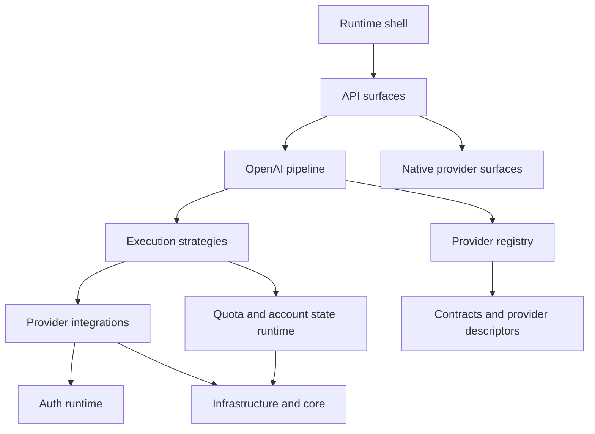

# Component Map

## Назначение

Этот документ даёт logical component view платформы.

Он отвечает на вопросы:

- какие крупные runtime components существуют;
- за что отвечает каждый component;
- как component связан с другими components;
- в какие Python packages нужно идти для детального code reading.

Для layer model см. [`docs/architecture/layers.md`](docs/architecture/layers.md:1).

Для package-level mapping см. [`docs/architecture/package-map.md`](docs/architecture/package-map.md:1).

## Workspace boundaries

### Root runtime scope

В scope этой карты входят:

- runtime package [`llm_agent_platform/`](llm_agent_platform:1)
- bootstrap scripts [`scripts/`](scripts:1)
- canonical docs and contracts in [`docs/`](docs:1)

### Reference upstreams

Внешние nested repos не входят в runtime package map и рассматриваются как reference-only context:

- [`qwen-code/`](qwen-code:1)
- [`gemini-cli/`](gemini-cli:1)
- [`kilocode/`](kilocode:1)

## Logical components

### 1. Runtime shell

- Responsibility: process bootstrap, Flask app assembly, blueprint registration.
- Primary code: [`llm_agent_platform/__main__.py`](llm_agent_platform/__main__.py:1)
- Outbound links: API surfaces, auth initialization.

### 2. OpenAI-compatible API surface

- Responsibility: provider-scoped public HTTP contract for `/models` and `chat/completions`.
- Primary code: [`llm_agent_platform/api/openai/`](llm_agent_platform/api/openai:1)
- Outbound links: OpenAI pipeline, provider registry, execution strategies.

### 3. Native provider API surfaces

- Responsibility: provider-native route namespaces outside the common OpenAI surface.
- Primary code:
  - [`llm_agent_platform/api/gemini/`](llm_agent_platform/api/gemini:1)
  - [`llm_agent_platform/api/parity/`](llm_agent_platform/api/parity:1)
- Outbound links: auth, runtime services, transport helpers.

### 4. OpenAI pipeline orchestration

- Responsibility: request normalization, provider resolution, group/model validation, strategy resolution, stream/non-stream path composition.
- Primary code:
  - [`llm_agent_platform/api/openai/pipeline.py`](llm_agent_platform/api/openai/pipeline.py:1)
  - [`llm_agent_platform/api/openai/types.py`](llm_agent_platform/api/openai/types.py:1)
  - [`llm_agent_platform/api/openai/streaming.py`](llm_agent_platform/api/openai/streaming.py:1)
  - [`llm_agent_platform/api/openai/response_shaper.py`](llm_agent_platform/api/openai/response_shaper.py:1)
- Outbound links: provider integrations and runtime services.

### 5. Provider integrations

- Responsibility: provider-specific runtime adapters and transport normalization.
- Primary code: [`llm_agent_platform/api/openai/providers/`](llm_agent_platform/api/openai/providers:1)
- Outbound links: auth layer, HTTP transport, runtime services.

### 6. Execution strategy layer

- Responsibility: execution policy over provider adapters: direct execution, account selection, retry, rotation, semantic `429` handling.
- Primary code: [`llm_agent_platform/api/openai/strategies/`](llm_agent_platform/api/openai/strategies:1)
- Outbound links: provider integrations, account router, quota transport helpers.

### 7. Provider registry and declarative catalogs

- Responsibility: runtime resolution of provider descriptors, route names, bootstrap catalogs and provider metadata.
- Primary code:
  - [`llm_agent_platform/services/provider_registry.py`](llm_agent_platform/services/provider_registry.py:1)
  - [`llm_agent_platform/provider_registry/`](llm_agent_platform/provider_registry:1)
- Outbound links: pipeline, provider pages, contracts.

### 8. Auth runtime

- Responsibility: auth availability checks, runtime token refresh, provider-specific OAuth state handling.
- Primary code: [`llm_agent_platform/auth/`](llm_agent_platform/auth:1)
- Outbound links: provider integrations, bootstrap scripts, config.

### 9. Quota and account state runtime

- Responsibility: account routing, group isolation, cooldown/exhausted semantics, persisted account state, group snapshots.
- Primary code:
  - [`llm_agent_platform/services/account_router.py`](llm_agent_platform/services/account_router.py:1)
  - [`llm_agent_platform/services/account_state_store.py`](llm_agent_platform/services/account_state_store.py:1)
  - [`llm_agent_platform/services/runtime_state_paths.py`](llm_agent_platform/services/runtime_state_paths.py:1)
  - [`llm_agent_platform/services/credentials_paths.py`](llm_agent_platform/services/credentials_paths.py:1)
- Outbound links: strategies, provider adapters, monitoring artifacts.

### 10. Monitoring and provider usage adapters

- Responsibility: provider-specific monitoring-only usage snapshots and future admin read-model support boundary.
- Primary code: [`llm_agent_platform/services/provider_usage_limits.py`](llm_agent_platform/services/provider_usage_limits.py:1)
- Canonical boundary docs:
  - [`docs/architecture/admin-monitoring-read-model.md`](docs/architecture/admin-monitoring-read-model.md:1)
  - [`docs/providers/openai-chatgpt.md`](docs/providers/openai-chatgpt.md:1)

### 11. Shared infrastructure and core

- Responsibility: env config, shared HTTP client, logging and common helpers.
- Primary code:
  - [`llm_agent_platform/config.py`](llm_agent_platform/config.py:1)
  - [`llm_agent_platform/services/http_pool.py`](llm_agent_platform/services/http_pool.py:1)
  - [`llm_agent_platform/core/`](llm_agent_platform/core:1)

## Interaction summary

## Related documents

- Architecture entrypoint: [`docs/architecture/index.md`](docs/architecture/index.md:1)
- System overview: [`docs/architecture/system-overview.md`](docs/architecture/system-overview.md:1)
- Package map: [`docs/architecture/package-map.md`](docs/architecture/package-map.md:1)
- Runtime flows: [`docs/architecture/runtime-flows.md`](docs/architecture/runtime-flows.md:1)
