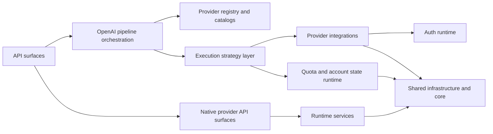

# Component View

## Назначение

Этот документ фиксирует `C4 Component` уровень для основного container `Runtime API process`.

Он отвечает на вопрос, из каких внутренних крупных runtime components состоит основной process и как между ними проходит основной request path.

Для code-oriented navigation см. [`component-map.md`](./component-map.md) и [`package-map.md`](./package-map.md).

## Scope

В scope этого view входят только внутренние components container `Runtime API process`.

Вне scope:

- `Web UI` как отдельный container в [`web-ui.md`](./web-ui.md);
- `OAuth bootstrap scripts` как отдельный operational container в [`container-view.md`](./container-view.md);
- внешние `LLM provider` systems из [`terms-map.md`](../terms/project/terms-map.md).

## C4 Component diagram

## Components

| Component | Role | Main dependencies | Status |
| --- | --- | --- | --- |
| Runtime shell | Собирает Flask app и регистрирует runtime routes. | API surfaces, auth runtime, shared infrastructure | materialized in code |
| API surfaces | Держит provider-scoped [`OpenAI-compatible API`](../terms/project/terms/openai-compatible-api.md) и provider-native HTTP entrypoints. | OpenAI pipeline orchestration, runtime services | materialized in code |
| OpenAI pipeline orchestration | Строит request context, валидирует provider/group/model scope и собирает response path. | Provider registry and catalogs, execution strategy layer | materialized in code |
| Native provider API surfaces | Обслуживает route namespaces вне общего OpenAI surface. | Runtime services, auth runtime, shared infrastructure | materialized in code |
| Provider registry and catalogs | Резолвит provider descriptors, route namespaces и provider-local catalogs. | Declarative provider registry data | materialized in code |
| Execution strategy layer | Выбирает execution policy: direct path, retries, rotation, semantic `429` handling. | Provider integrations, quota and account state runtime | materialized in code |
| Provider integrations | Инкапсулирует `provider implementation`: provider-specific transport, protocol adaptation и upstream response normalization. | Auth runtime, shared infrastructure and core | materialized in code |
| Quota and account state runtime | Управляет account selection, cooldown, exhausted state и persisted group/account snapshots. | Shared infrastructure and core | materialized in code |
| Runtime services | Даёт общие runtime ports: monitoring adapters, state-path resolution, quota transport helpers. | Shared infrastructure and core | materialized in code |
| Auth runtime | Управляет credentials discovery и runtime OAuth refresh. | Shared infrastructure and core | materialized in code |
| Shared infrastructure and core | Даёт env config, HTTP client, async state writer, logging и общие helpers. | none upward | materialized in code |

## Main interaction path

1. `API surfaces` принимают HTTP request.
2. `OpenAI pipeline orchestration` резолвит provider scope и execution path.
3. `Provider registry and catalogs` подтверждает provider-local metadata и model visibility.
4. `Execution strategy layer` выбирает policy исполнения.
5. `Provider integrations` выполняют upstream request с опорой на `Auth runtime` и `Shared infrastructure and core`, при необходимости адаптируя `OpenAI-compatible API` к vendor-specific upstream API.
6. `Quota and account state runtime` и `Runtime services` обновляют runtime state и monitoring artifacts, когда это требуется сценарием.

## Distinction between implemented and planned

- Этот view описывает только materialized internal components `Runtime API process`.
- `Web UI` и admin-facing read models остаются отдельными canonized boundaries, но не являются components этого container-level view.
- `user service` как отдельный boundary пока не канонизирован и остается open question, а не частью текущего component model.

## Related documents

- `C4 Context`: [`system-overview.md`](./system-overview.md)
- `C4 Container`: [`container-view.md`](./container-view.md)
- code-oriented component navigation: [`component-map.md`](./component-map.md)
- package-level traceability: [`package-map.md`](./package-map.md)
- runtime scenarios: [`runtime-flows.md`](./runtime-flows.md)
