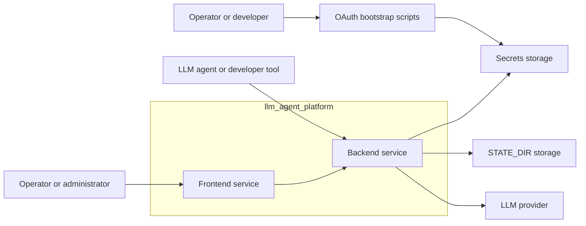

# Container View

## Назначение

Этот документ фиксирует `C4 Container` уровень для `llm_agent_platform`.

Он показывает крупные исполняемые и delivery-части системы, а не внутренние Python packages.

## Scope

В этом view:

- `llm_agent_platform` рассматривается как system boundary;
- внутри boundary показываются только runtime services и operational helper containers этой системы;
- внешние `LLM provider` systems и storage показываются как external dependencies.

`HSM` используется в проекте как external stack orchestration technology, но не входит в этот `C4 Container` diagram как внутренний container.

Более глубокий уровень детализации вынесен в [`component-view.md`](./component-view.md), [`component-map.md`](./component-map.md), [`runtime-flows.md`](./runtime-flows.md) и [`package-map.md`](./package-map.md).

## C4 Container diagram

## Containers inside the system boundary

### Backend service

- Role: основной machine-facing и admin-facing runtime service платформы.
- Responsibilities:
  - provider-scoped [`OpenAI-compatible API`](../terms/project/terms/openai-compatible-api.md);
  - provider-native routes;
  - auth/runtime/quota orchestration вокруг `abstract provider` и `provider implementation`.
- Primary implementation: [`llm_agent_platform/__main__.py`](../../llm_agent_platform/__main__.py), [`component-view.md`](./component-view.md)
- Service lifecycle orchestration и dev/prod materialization выполняются через [`HSM`](../terms/project/terms/hsm.md).
- Status: materialized in code; target repo boundary — отдельный `Backend service` repository.

### OAuth bootstrap scripts

- Role: отдельный operational container для локального получения и обновления user credentials.
- Responsibilities:
  - загрузить bootstrap env;
  - пройти OAuth flow;
  - записать credentials в `Secrets storage`.
- Primary implementation: [`scripts/`](../../scripts)
- Status: materialized in code.

### Frontend service

- Role: human-facing web service поверх backend admin API.
- Responsibilities:
  - human-facing access к platform capabilities;
  - navigation and interaction layer для user и admin scenarios;
  - role-aware visibility через `RBAC`.
- Details: [`web-ui.md`](./web-ui.md)
- Primary implementation: [`services/frontend/`](../../services/frontend)
- Service lifecycle orchestration и dev/prod materialization выполняются через [`HSM`](../terms/project/terms/hsm.md).
- Status: materialized как local-only operator-facing service; full target `Web UI` architecture по-прежнему шире текущей реализации.

## External systems and storage

### LLM provider

- Role: внешняя [`LLM provider`](../terms/project/terms/llm-provider.md) system boundary для upstream LLM integrations.
- Includes:
  - `openai-chatgpt`
  - `gemini-cli`
  - `google-vertex`
  - `qwen-code`

Provider readiness matrix и current provider canon задаются в [`index.md`](../providers/index.md).

### Secrets storage

- Role: accounts-config для `LLM provider` и user credentials storage.
- Used by:
  - `Backend service`
  - `OAuth bootstrap scripts`

### STATE_DIR storage

- Role: mutable runtime state и monitoring artifacts.
- Used by:
  - `Backend service`

## Main relations

- `Operator or administrator` использует `Frontend service` для human-facing access к платформе.
- `LLM agent or developer tool` использует `Backend service` как machine-facing API surface.
- `Operator or developer` использует `OAuth bootstrap scripts` для подготовки credentials.
- `Frontend service` использует только `Backend service`.
- `Backend service` читает `Secrets storage`, использует `STATE_DIR storage` и обращается к внешнему `LLM provider`.

## Status notes

- В текущем PoC materialized containers: `Backend service`, `OAuth bootstrap scripts`, local-only `Frontend service` operator slice.
- `Frontend service` уже реализован как отдельный nested frontend repo/service, а `Backend service` готовится к выделению в отдельный repo boundary.
- `docker-compose` и `HSM` не являются runtime containers этой диаграммы; они относятся к local delivery и stack management layer.

## Related documents

- `C4 Context`: [`system-overview.md`](./system-overview.md)
- `C4 Component`: [`component-view.md`](./component-view.md)
- component-to-code map: [`component-map.md`](./component-map.md)
- runtime interactions: [`runtime-flows.md`](./runtime-flows.md)
- package mapping: [`package-map.md`](./package-map.md)
