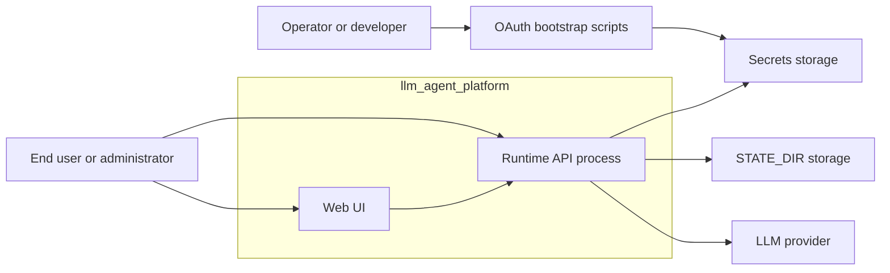

# Container View

## Назначение

Этот документ фиксирует `C4 Container` уровень для `llm_agent_platform`.

Он показывает крупные исполняемые и delivery-части системы, а не внутренние Python packages.

## Scope

В этом view:

- `llm_agent_platform` рассматривается как system boundary;
- внутри boundary показываются runtime и delivery containers;
- внешние `LLM provider` systems и storage показываются как external dependencies.

Более глубокий уровень детализации вынесен в [`component-view.md`](./component-view.md), [`component-map.md`](./component-map.md), [`runtime-flows.md`](./runtime-flows.md) и [`package-map.md`](./package-map.md).

## C4 Container diagram

## Containers inside the system boundary

### Runtime API process

- Role: основной runtime process платформы.
- Responsibilities:
  - provider-scoped [`OpenAI-compatible API`](../terms/project/terms/openai-compatible-api.md);
  - provider-native routes;
  - auth/runtime/quota orchestration вокруг `abstract provider` и `provider implementation`.
- Primary implementation: [`llm_agent_platform/__main__.py`](../../llm_agent_platform/__main__.py), [`component-view.md`](./component-view.md)
- Status: materialized in code.

### OAuth bootstrap scripts

- Role: отдельный operational container для локального получения и обновления user credentials.
- Responsibilities:
  - загрузить bootstrap env;
  - пройти OAuth flow;
  - записать credentials в `Secrets storage`.
- Primary implementation: [`scripts/`](../../scripts)
- Status: materialized in code.

### Web UI

- Role: единый human-facing web container поверх runtime API.
- Responsibilities:
  - human-facing access к platform capabilities;
  - navigation and interaction layer для user и admin scenarios;
  - role-aware visibility через `RBAC`.
- Details: [`web-ui.md`](./web-ui.md)
- Status: planned container; runtime boundary полезно зафиксировать заранее, even if implementation еще не materialized.

## External systems and storage

### LLM provider

- Role: внешняя [`LLM provider`](../terms/project/terms/llm-provider.md) system boundary для upstream LLM integrations.
- Includes:
  - `openai-chatgpt`
  - `gemini-cli`
  - `google-vertex`
  - `qwen-code`

### Secrets storage

- Role: accounts-config для `LLM provider` и user credentials storage.
- Used by:
  - `Runtime API process`
  - `OAuth bootstrap scripts`

### STATE_DIR storage

- Role: mutable runtime state и monitoring artifacts.
- Used by:
  - `Runtime API process`

## Main relations

- `End user or administrator` использует `Web UI` для human-facing access к платформе.
- `Operator or developer` использует `OAuth bootstrap scripts` для подготовки credentials.
- `Runtime API process` читает `Secrets storage`, использует `STATE_DIR storage` и обращается к внешнему `LLM provider`.

## Status notes

- В текущем root runtime materialized containers: `Runtime API process`, `OAuth bootstrap scripts`.
- `Web UI` здесь зафиксирован как целевой container для дальнейшей архитектурной навигации, а не как уже реализованный runtime package.
- Если UI boundary materialize-ится как отдельный repo или отдельный runtime, этот документ должен остаться container-level SoT entry point, а package mapping нужно будет держать в соответствующем local context.

## Related documents

- `C4 Context`: [`system-overview.md`](./system-overview.md)
- `C4 Component`: [`component-view.md`](./component-view.md)
- component-to-code map: [`component-map.md`](./component-map.md)
- runtime interactions: [`runtime-flows.md`](./runtime-flows.md)
- package mapping: [`package-map.md`](./package-map.md)
