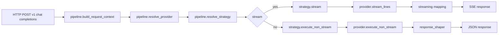

# OpenAI `chat_completions` pipeline: Providers + Strategies + Streaming (канон)

Цель: зафиксировать текущую каноническую архитектуру обработки `POST /v1/chat/completions` после рефакторинга на слои:
- Pipeline orchestration;
- Providers (интеграции LLM);
- Execution strategies (политики выполнения поверх providers);
- Streaming mapping + response shaping.

## Scope
- Только OpenAI-compatible endpoint `POST /v1/chat/completions` (stream и non-stream ветки).
- Сохранение OpenAI stream/non-stream контракта.

Non-scope:
- Repo layout перенос в `src/` (см. [`docs/adr/0016-codebase-layout-separate-runtime-app-and-local-scripts.md`](docs/adr/0016-codebase-layout-separate-runtime-app-and-local-scripts.md:1)).

## Source of Truth
- Реализация:
  - Routes entry: [`api/openai/routes.py`](api/openai/routes.py:1)
  - Pipeline: [`api/openai/pipeline.py`](api/openai/pipeline.py:1)
  - Types/context: [`api/openai/types.py`](api/openai/types.py:1)
  - Providers:
    - Base: [`api/openai/providers/base.py`](api/openai/providers/base.py:1)
    - Gemini CLI quota: [`api/openai/providers/gemini_cli.py`](api/openai/providers/gemini_cli.py:1)
    - Qwen Code quota: [`api/openai/providers/qwen_code.py`](api/openai/providers/qwen_code.py:1)
    - Google Vertex: [`api/openai/providers/google_vertex.py`](api/openai/providers/google_vertex.py:1)
  - Strategies:
    - Base: [`api/openai/strategies/base.py`](api/openai/strategies/base.py:1)
    - Registry: [`api/openai/strategies/registry.py`](api/openai/strategies/registry.py:1)
    - Direct: [`api/openai/strategies/direct.py`](api/openai/strategies/direct.py:1)
    - Rotate-on-429 (quota rounding): [`api/openai/strategies/rotate_on_429_rounding.py`](api/openai/strategies/rotate_on_429_rounding.py:1)
  - Streaming: [`api/openai/streaming.py`](api/openai/streaming.py:1)
  - Response shaping: [`api/openai/response_shaper.py`](api/openai/response_shaper.py:1)

## Responsibilities & boundaries
### Route layer
- Flask route — тонкий адаптер HTTP → pipeline.
- Не содержит provider-specific или strategy-specific логики.

### Pipeline orchestration
- `build_request_context`: нормализует входной запрос в внутренний контекст.
- `resolve_provider`: выбирает Provider по контексту.
- `resolve_strategy`: выбирает Strategy по контексту и конфигурации.
- `handle_non_stream` / `handle_stream`: единые пайплайны, которые делегируют выполнение Strategy + shaping.

### Providers
- Инкапсулируют транспорт и runtime credentials use.
- Не содержат политики ротации (это обязанность Strategy).

### Strategies
- Инкапсулируют «как выполнить запрос» поверх Provider:
  - выбор аккаунта (для quota),
  - retry/rotation правила,
  - обработку семантических 429,
  - работу со stream/non-stream execution.

### Streaming mapping & response shaping
- Преобразование upstream stream событий в OpenAI SSE chunks выполняется в [`api/openai/streaming.py`](api/openai/streaming.py:1).
- Формирование non-stream ответа выполняется в [`api/openai/response_shaper.py`](api/openai/response_shaper.py:1).

## Data flow

## Invariants
- OpenAI-compatible shape: stream/non-stream ответы и ошибки должны оставаться совместимыми с тестами контракта.
- Quota-first: при quota моделях используется стратегия с учётом account router.

## Verification (evidence)
### Commands
- `uv run python -m compileall api auth core services main.py tests`
- `uv run python -m unittest discover -s tests -p "test_*.py"`

### Relevant suites
- OpenAI contract: [`docs/testing/suites/openai-contract.md`](docs/testing/suites/openai-contract.md:1)
- Proxy routes smoke: [`docs/testing/suites/proxy-routes.md`](docs/testing/suites/proxy-routes.md:1)

### Relevant tests
- Contract: [`tests/test_openai_contract.py`](tests/test_openai_contract.py:1)
- Routes smoke: [`tests/test_refactor_p2_routes.py`](tests/test_refactor_p2_routes.py:1)
