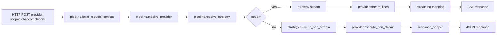

# OpenAI `chat_completions` pipeline: Providers + Strategies + Streaming (канон)

Цель: зафиксировать текущую каноническую архитектуру обработки provider-scoped `POST /<provider_name>/v1/chat/completions` после рефакторинга на слои:
- Pipeline orchestration;
- Providers (интеграции LLM);
- Execution strategies (политики выполнения поверх providers);
- Streaming mapping + response shaping.

## Scope
- Только provider-scoped OpenAI-compatible endpoint `POST /<provider_name>/v1/chat/completions` и `POST /<provider_name>/<group_name>/v1/chat/completions`.
- Сохранение OpenAI stream/non-stream контракта.

Non-scope:
- Repo layout перенос в `src/` (см. [`docs/adr/0016-codebase-layout-separate-runtime-app-and-local-scripts.md`](docs/adr/0016-codebase-layout-separate-runtime-app-and-local-scripts.md:1)).

## Source of Truth
- Реализация:
  - Routes entry: [`services/backend/llm_agent_platform/api/openai/routes.py`](services/backend/llm_agent_platform/api/openai/routes.py:1)
  - Pipeline: [`services/backend/llm_agent_platform/api/openai/pipeline.py`](services/backend/llm_agent_platform/api/openai/pipeline.py:1)
  - Types/context: [`services/backend/llm_agent_platform/api/openai/types.py`](services/backend/llm_agent_platform/api/openai/types.py:1)
  - Providers:
    - Base: [`services/backend/llm_agent_platform/api/openai/providers/base.py`](services/backend/llm_agent_platform/api/openai/providers/base.py:1)
    - Gemini CLI quota: [`services/backend/llm_agent_platform/api/openai/providers/gemini_cli.py`](services/backend/llm_agent_platform/api/openai/providers/gemini_cli.py:1)
    - Qwen Code quota: [`services/backend/llm_agent_platform/api/openai/providers/qwen_code.py`](services/backend/llm_agent_platform/api/openai/providers/qwen_code.py:1)
    - Google Vertex: [`services/backend/llm_agent_platform/api/openai/providers/google_vertex.py`](services/backend/llm_agent_platform/api/openai/providers/google_vertex.py:1)
  - Strategies:
    - Base: [`services/backend/llm_agent_platform/api/openai/strategies/base.py`](services/backend/llm_agent_platform/api/openai/strategies/base.py:1)
    - Registry: [`services/backend/llm_agent_platform/api/openai/strategies/registry.py`](services/backend/llm_agent_platform/api/openai/strategies/registry.py:1)
    - Direct: [`services/backend/llm_agent_platform/api/openai/strategies/direct.py`](services/backend/llm_agent_platform/api/openai/strategies/direct.py:1)
    - Rotate-on-429: [`services/backend/llm_agent_platform/api/openai/strategies/rotate_on_429_rounding.py`](services/backend/llm_agent_platform/api/openai/strategies/rotate_on_429_rounding.py:1)
  - Streaming: [`services/backend/llm_agent_platform/api/openai/streaming.py`](services/backend/llm_agent_platform/api/openai/streaming.py:1)
  - Response shaping: [`services/backend/llm_agent_platform/api/openai/response_shaper.py`](services/backend/llm_agent_platform/api/openai/response_shaper.py:1)

## Responsibilities & boundaries
### Route layer
- Flask route — тонкий адаптер HTTP → pipeline.
- Резолвит provider namespace из URL.
- Не содержит provider-specific transport или strategy-specific runtime логики.

### Pipeline orchestration
- `build_request_context`: нормализует входной запрос в внутренний контекст.
- `resolve_provider`: выбирает runtime adapter по provider descriptor.
- `resolve_strategy`: выбирает Strategy по контексту и конфигурации.
- `handle_non_stream` / `handle_stream`: единые пайплайны, которые делегируют выполнение Strategy + shaping.

Граница слоёв:
- descriptor contract задаёт declarative provider metadata и capabilities;
- registry/pipeline резолвит descriptor и связывает его с runtime adapter;
- provider adapter исполняет provider-specific transport/auth contract;
- strategy исполняет retry, rotation и quota-policy semantics поверх adapter.

Дополнительные обязанности pipeline:
- провалидировать `model` внутри provider-local catalog;
- определить default group или named group внутри provider namespace.

### Providers
- Инкапсулируют транспорт и runtime credentials use.
- Не содержат политики ротации (это обязанность Strategy).

Provider-specific runtime semantics должны документироваться на выделенных страницах в [`docs/providers/`](docs/providers:1).

### Strategies
- Инкапсулируют «как выполнить запрос» поверх Provider:
  - выбор аккаунта (для quota),
  - retry/rotation правила,
  - обработку семантических 429,
  - работу со stream/non-stream execution.

### Streaming mapping & response shaping
- Преобразование upstream stream событий в OpenAI SSE chunks выполняется в [`services/backend/llm_agent_platform/api/openai/streaming.py`](services/backend/llm_agent_platform/api/openai/streaming.py:1).
- Формирование non-stream ответа выполняется в [`services/backend/llm_agent_platform/api/openai/response_shaper.py`](services/backend/llm_agent_platform/api/openai/response_shaper.py:1).

## Data flow

## Invariants
- OpenAI-compatible shape: stream/non-stream ответы и ошибки должны оставаться совместимыми с тестами контракта.
- Provider выбирается только из URL, а не по `model_id`.
- Модель валидируется только внутри provider-local catalog.
- Quota-first strategy применяется только для quota-based providers.

## Usage-limits capability
- Quota exhaustion определяется по runtime request path и provider-specific error semantics.
- Если provider поддерживает отдельный usage endpoint, proactive usage polling допустим только как observability/monitoring enhancement.
- Normalized usage snapshot не заменяет runtime decision path и не является обязательной capability каждого provider.

Provider-specific инвариант для [`openai-chatgpt`](docs/providers/openai-chatgpt.md:1):
- `one forced refresh retry on auth failure`

## Verification (evidence)
### Commands
- `cd services/backend && uv run python -m compileall llm_agent_platform`
- `cd services/backend && uv run python -m unittest discover -s llm_agent_platform/tests -p "test_*.py"`

### Relevant suites
- OpenAI contract: [`docs/testing/suites/openai-contract.md`](docs/testing/suites/openai-contract.md:1)
- Proxy routes smoke: [`docs/testing/suites/proxy-routes.md`](docs/testing/suites/proxy-routes.md:1)

### Relevant tests
- Contract: [`services/backend/llm_agent_platform/tests/test_openai_contract.py`](services/backend/llm_agent_platform/tests/test_openai_contract.py:1)
- Routes smoke: [`services/backend/llm_agent_platform/tests/test_refactor_p2_routes.py`](services/backend/llm_agent_platform/tests/test_refactor_p2_routes.py:1)
