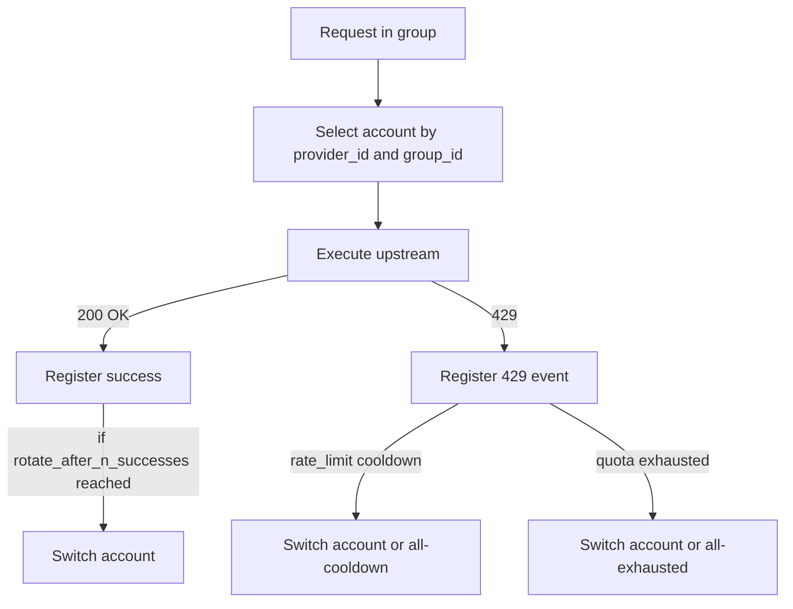

# Quota account rotation: policies + groups + group-aware `/v1/models` (канон)

Цель: зафиксировать каноническое описание уже реализованного quota-first account-rotation контура:
- rotation policies: `random_order` + `rotate_after_n_successes`;
- группы аккаунтов (изоляция state/счётчиков по `(provider_id, group_id)`);
- URL-prefix groups (вариант B): `/<group_id>/v1/*` при сохранении default `g0` на `/v1/*`;
- group-aware `GET /v1/models`.

## Scope
- Только quota контуры провайдеров `gemini_cli` и `qwen_code`.
- OpenAI-compatible API: `/v1/chat/completions`, `/v1/models`.

Non-scope:
- Реальные upstream лимиты и их SLA.
- E2E тесты с реальными OAuth токенами.

## Source of Truth (самодостаточно)
- Реализация (ключевые точки):
  - Router: [`services/account_router.py`](services/account_router.py:1)
  - Strategy: [`api/openai/strategies/rotate_on_429_rounding.py`](api/openai/strategies/rotate_on_429_rounding.py:1)
  - Routes: [`api/openai/routes.py`](api/openai/routes.py:1)
- Тест-дизайн и трассировка:
  - Suite: [`docs/testing/suites/quota-account-rotation.md`](docs/testing/suites/quota-account-rotation.md:1)
  - Test map: [`docs/testing/test-map.md`](docs/testing/test-map.md:1)
- ADR по URL-prefix groups и group-aware models: [`docs/adr/0017-url-prefix-groups-and-group-aware-models.md`](docs/adr/0017-url-prefix-groups-and-group-aware-models.md:1)

## Конфигурация (provider accounts-config)
Ключевые элементы accounts-config (см. примеры):
- Gemini: [`docs/examples/gemini_accounts_config.example.json`](docs/examples/gemini_accounts_config.example.json:1)
- Qwen: [`docs/examples/qwen_accounts_config.example.json`](docs/examples/qwen_accounts_config.example.json:1)

### `rotation_policy`
- `rotation_policy.random_order: bool` — random-order поведение для rounding:
  - первый выбор аккаунта для пары `(provider_id, group_id)` — случайный среди доступных;
  - при недоступности текущего (cooldown/exhausted) следующий выбор тоже случайный среди доступных;
  - переключение по триггерам (429/BY-N) использует тот же random-order алгоритм выбора.
- `rotation_policy.rotate_after_n_successes: int` — after-N: переключать аккаунт после N успешных запросов.
- `rotation_policy.rate_limit_threshold`, `rotation_policy.quota_exhausted_threshold`, `rotation_policy.rate_limit_cooldown_seconds` — параметры 429 policy.

### `groups` и default group `g0`
- `groups.<gid>.accounts: list[str]` — пул аккаунтов группы.
- `groups.<gid>.models: list[str]` — список моделей, который будет возвращён `GET /<gid>/v1/models`.
- Backward compatibility:
  - если `groups` отсутствует, эквивалентно одной группе `g0`, построенной из `all_accounts`.

## Внешний HTTP контракт (OpenAI-compatible)
### Group selection: URL-prefix (вариант B)
- Default: `/v1/*` означает `group_id=g0`.
- Group-specific: `/<group_id>/v1/*` означает `group_id=<group_id>`.

Эндпоинты:
- `POST /v1/chat/completions`
- `POST /<group_id>/v1/chat/completions`
- `GET /v1/models`
- `GET /<group_id>/v1/models`

### Group-aware `/v1/models`
- Если в provider-config присутствует `groups`, список моделей берётся из `groups.<gid>.models` по всем провайдерам (union).
- Если `groups` отсутствует, используется backward-compatible поведение (динамически по доступной авторизации), см. описание в [`docs/auth.md`](docs/auth.md:134).

### 429 contract: all-cooldown vs all-exhausted
Нормативный JSON schema для 429 ошибок:
- [`docs/contracts/api/openai/errors/429-error.schema.json`](docs/contracts/api/openai/errors/429-error.schema.json:1)

Коды:
- `all_accounts_on_cooldown` — transient (rate-limit cooldown), message содержит `please wait <seconds>`.
- `all_accounts_exceed_quota` — exhausted до reset window.

Связанное решение (концептуальная база): [`docs/adr/0014-stream-state-container-and-429-rotation-policy.md`](docs/adr/0014-stream-state-container-and-429-rotation-policy.md:1)

## Внутренний state и инварианты
State ведётся по ключу `(provider_id, group_id)`:
- изоляция счётчиков ошибок/успехов и указателя текущего аккаунта между группами.

Инварианты:
- 429 policy всегда имеет приоритет над by-N.
- by-N считает только успешные запросы (best-effort при параллельных запросах).

## Потоки

## Verification (evidence)
### Commands
- `uv run python -m compileall api auth core services main.py tests`
- `uv run python -m unittest discover -s tests -p "test_*.py"`

### Relevant tests
- Router unit: [`tests/test_quota_account_router.py`](tests/test_quota_account_router.py:1)
- Routes: [`tests/test_refactor_p2_routes.py`](tests/test_refactor_p2_routes.py:1)
- OpenAI contract: [`tests/test_openai_contract.py`](tests/test_openai_contract.py:1)

## ADR
- [`docs/adr/0017-url-prefix-groups-and-group-aware-models.md`](docs/adr/0017-url-prefix-groups-and-group-aware-models.md:1)
