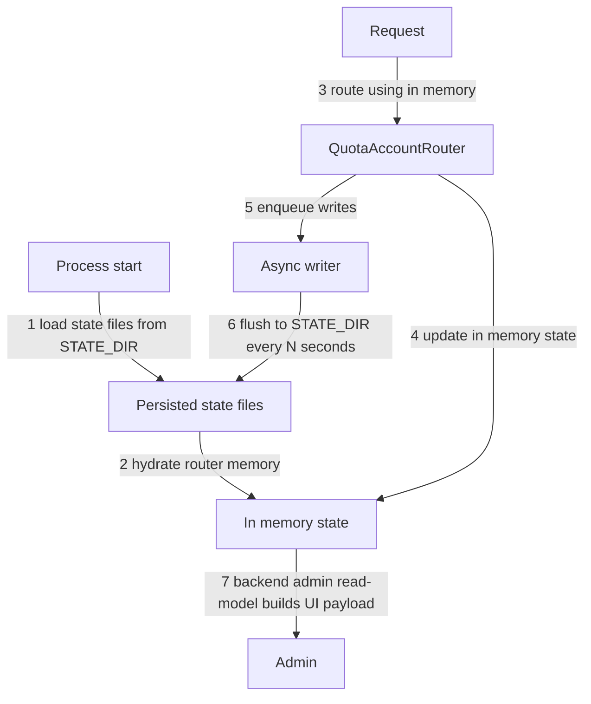

# Quota state persistence: `STATE_DIR`, account state, provider monitoring snapshots and async writer

- Status: Accepted
- Date: 2026-03-18

## Цель

1) Сделать persisted quota state более удобным и устойчивым к рестартам:

- исчерпание квоты (exhausted)
- cooldown (rate-limit)
- last_used (для refresh policy)

2) Добавить человеко-читаемый snapshot по группе аккаунтов (provider-scoped group) для администратора:

- сколько всего аккаунтов в группе
- сколько аккаунтов в cooldown
- сколько аккаунтов исчерпали квоты
- доля cooldown от общего числа
- доля аккаунтов с неисчерпанной квотой

3) Вынести state-файлы на HDD (много перезаписей), оставив secrets/credentials на SSD.
4) Зафиксировать provider-specific account monitoring artifacts и boundary для admin read-model.

---

## Контекст

Сейчас persisted quota state уже существует (переживает рестарт), но:

- хранится в layout, привязанном к `secrets/<provider_id>/state/...`;
- cooldown в основном in-memory и не переживает рестарт;
- администратору хочется видеть агрегированную статистику per group.

Канонический контекст существующего quota-роутинга и групп:

- [`docs/architecture/quota-account-rotation-groups-and-models.md`](docs/architecture/quota-account-rotation-groups-and-models.md:1)
- [`docs/architecture/quota-reset-periods-and-account-state.md`](docs/architecture/quota-reset-periods-and-account-state.md:1)

## Source of Truth (self-contained)

- ADR: [`docs/adr/0019-state-dir-unified-account-state-and-async-writer.md`](docs/adr/0019-state-dir-unified-account-state-and-async-writer.md:1)
- Contracts:
  - Provider config: [`docs/contracts/config/provider-accounts-config.schema.json`](docs/contracts/config/provider-accounts-config.schema.json:1)
  - Account state v1: [`docs/contracts/state/account-state.schema.json`](docs/contracts/state/account-state.schema.json:1)
  - Group quota snapshot v1: [`docs/contracts/state/group-quota-state.schema.json`](docs/contracts/state/group-quota-state.schema.json:1)

---

## Decision 1: отдельная директория для runtime state (`STATE_DIR`)

### Мотивация

- сервис и `secrets/` находятся на SSD;
- state-файлы часто перезаписываются и их хочется хранить на HDD.

### Правило

- `STATE_DIR` (runtime env) задаёт директорию для **всех** state-файлов.
- `STATE_DIR` — optional runtime env с code default `/app/state`.
- Для container/runtime deployments переменная должна инжектиться явно через [`docker-compose.yml`](docker-compose.yml:1) и обычно монтироваться на HDD.
- Для локальной разработки допускается override на любую удобную HDD-backed директорию.

Рекомендованный пример (в контейнере):

- `STATE_DIR=/app/state`

---

## Decision 2: account-centric runtime layout

### Layout

Файлы состояния лежат под `STATE_DIR`:

```text
<STATE_DIR>/
  <provider_id>/
    accounts/
      <account_name>/
        account_state.json
        usage_windows.json
        request_usage.json
    groups/
      <group_id>/
        quota_state.json
```

### Формат `account_state.json` (v1)

```json
{
  "version": 1,
  "last_used_at": "2026-03-17T16:00:00Z",
  "cooldown": {
    "last_cooldown_at": "2026-03-17T16:01:00Z"
  },
  "quota_exhausted": {
    "keys": {
      "qwen-coder-model-quota": "2026-03-17T03:10:00Z",
      "__provider__": "2026-03-17T03:10:00Z"
    }
  }
}
```

Контракт:

- [`docs/contracts/state/account-state.schema.json`](docs/contracts/state/account-state.schema.json:1)

Допустимые дополнительные поля для provider-specific normalized block state:

- `quota_blocked_until`
- `quota_block_reason`
- `quota_block_metadata`

### Breaking boundary

- legacy split-layout (`last_used_at.json` + `quota_exhausted/<model>.json`) в новом контуре больше не поддерживается;
- миграция старых state-файлов не выполняется; accepted loss касается только runtime state, не credentials.

### Семантика cooldown

- cooldown вычисляется как `now < last_cooldown_at + rate_limit_cooldown_seconds`.
- `rate_limit_cooldown_seconds` берётся из provider-config.
- Если администратор изменит `rate_limit_cooldown_seconds`, уже начавшийся cooldown пересчитается по новым правилам (это желаемое поведение).

### Семантика exhausted

Exhausted определяется через `quota_exhausted.keys` и `model_quota_resets`:

- берём `quota_exhausted_at` из `account_state.json` (по ключу модели или `__provider__`)
- считаем `quota_exhausted_until = quota_exhausted_at + period(model_quota_resets[model|default])`
- exhausted если `now < quota_exhausted_until`

---

## Decision 3: provider quota scope (`per_model` vs `per_provider`)

Разные провайдеры могут иметь разную семантику квоты:

- `per_model`: квота считается отдельно по каждой модели
- `per_provider`: квота общая на провайдера (на все модели вместе)

Поэтому в provider accounts-config добавляем поле:

- `quota_scope: per_model | per_provider`

Правило отображения в `account_state.json.quota_exhausted.keys`:

- `per_model`: ключ = реальное имя модели
- `per_provider`: ключ = `__provider__`

---

## Decision 4: group snapshot `quota_state.json` (admin мониторинг)

### Layout

```
<STATE_DIR>/
  <provider_id>/
    groups/
      <group_id>/
        quota_state.json
```

### Формат snapshot (v1)

Общие поля:

- `total_accounts`
- `cooldown_accounts`
- `cooldown_ratio`
- `as_of`
- `quota_scope`

#### Вариант `per_model`

`quota_state.json` содержит `models`:

```json
{
  "version": 1,
  "provider_id": "qwen_code",
  "group_id": "g1",
  "quota_scope": "per_model",
  "as_of": "2026-03-17T16:00:00Z",
  "total_accounts": 2,
  "cooldown_accounts": 1,
  "cooldown_ratio": 0.5,
  "models": {
    "qwen-coder-model-quota": {
      "exhausted_accounts": 1,
      "not_exhausted_ratio": 0.5
    }
  }
}
```

#### Вариант `per_provider`

`quota_state.json` содержит `provider`:

```json
{
  "version": 1,
  "provider_id": "qwen_code",
  "group_id": "g1",
  "quota_scope": "per_provider",
  "as_of": "2026-03-17T16:00:00Z",
  "total_accounts": 2,
  "cooldown_accounts": 1,
  "cooldown_ratio": 0.5,
  "provider": {
    "exhausted_accounts": 1,
    "not_exhausted_ratio": 0.5
  }
}
```

Примечания:

- Snapshot содержит **только числа/доли**, без списков аккаунтов.
- Если provider не объявляет явные `groups`, runtime использует логическую дефолтную группу `g0` и может писать snapshot для неё.
- Snapshot — monitoring артефакт и не является source of truth для routing.
- Snapshot допустим как persisted monitoring artifact, но не как live UI transport.

Контракт:

- [`docs/contracts/state/group-quota-state.schema.json`](docs/contracts/state/group-quota-state.schema.json:1)

---

## Runtime: in-memory routing + async persistence

### Принцип работы

В этом документе **hydrate state** = «восстановить in-memory состояние из persisted файлов».

- при первом доступе к конкретному `(provider_id, group_id)` после старта процесса runtime лениво читает state-файлы из `STATE_DIR` и восстанавливает in-memory состояние роутера;
- во время работы routing использует только in-memory;
- запись state на диск — best-effort и асинхронная.

Provider-specific monitoring snapshots подчиняются тем же правилам:

- `usage_windows.json` и `request_usage.json` обновляют in-memory snapshots first;
- затем prepared payload enqueue-ится в shared async writer;
- persisted files не считаются live source для runtime или admin UI.

### Mutation points

- `select_account()` может инициировать refresh group snapshot после восстановления state из файлов (`hydrate`) и `cleanup`, если изменилась наблюдаемая доступность группы;
- `select_account()` **не должен** сам по себе менять `last_used_at`;
- `register_success()` обновляет `last_used_at`, очищает cooldown и может сдвигать round-robin state;
- `register_event()` обновляет cooldown/exhausted состояние и enqueue'ит persisted account state + group snapshot.

Provider-specific mutation boundaries:

- monitoring refresh subsystem владеет `usage_windows.json`;
- request-usage collector владеет `request_usage.json`;
- router остаётся единственным owner для mutation routing truth в [`account_state.json`](docs/contracts/state/account-state.schema.json:1).

### Async writer: coalesce map

Writer использует coalesce map (last-write-wins buffer):

- `pending[path] = payload` (перезапись)
- periodic flush раз в `STATE_FLUSH_INTERVAL_SECONDS`
- ограничение `STATE_WRITER_MAX_PENDING_FILES` с политикой drop-oldest

### Runtime defaults

- `STATE_FLUSH_INTERVAL_SECONDS` — optional runtime env, default `3`.
- `STATE_WRITER_MAX_PENDING_FILES` — optional runtime env, default `1024`.
- Валидация:
  - `STATE_FLUSH_INTERVAL_SECONDS > 0`
  - `STATE_WRITER_MAX_PENDING_FILES >= 1`

Подробная теория: [`docs/theory/coalesce-map.md`](docs/theory/coalesce-map.md:1).

Дополнительный FAQ с примерами mixed updates, swap, merge-back и crash semantics: [`docs/theory/coalesce-map-faq.md`](docs/theory/coalesce-map-faq.md:1).

### Конкурентность: swap + merge-back

Чтобы не терять апдейты во время flush:

- flush выполняется через swap `pending -> to_flush`;
- если запись упала, `to_flush` merge-back в новый `pending` (не затирая более свежие значения).

### Lifecycle writer

- writer принадлежит quota-runtime процессу и существует в единственном экземпляре на процесс;
- background thread стартует лениво на первом `enqueue_write()`;
- при graceful shutdown выполняется best-effort final flush накопленного `pending`;
- при crash / `SIGKILL` допускается потеря последнего не-flushed хвоста изменений.

### Failure semantics

- write errors логируются на `warning` и не валят request-path;
- при переполнении `STATE_WRITER_MAX_PENDING_FILES` writer делает `drop-oldest`, логирует предупреждение и сохраняет более свежий payload для нового пути;
- per-file write остаётся атомарным (`tmp + replace`), но cross-file transactional consistency не гарантируется;
- `quota_state.json` может временно отставать от `account_state.json`, что допустимо для monitoring snapshot.

## Ownership matrix

| Artifact | Semantic owner | Persistence path | Read side | Semantics |
| --- | --- | --- | --- | --- |
| [`account_state.json`](docs/contracts/state/account-state.schema.json:1) | router | shared async writer only | router hydrate, admin read-model | routing-critical persisted backup |
| `usage_windows.json` | monitoring refresh subsystem | shared async writer only | provider quota handler, admin read-model | provider-specific monitoring truth |
| `request_usage.json` | runtime request-usage collector | shared async writer only | admin read-model | request-driven observability state |
| [`quota_state.json`](docs/contracts/state/group-quota-state.schema.json:1) | router snapshot builder | shared async writer only | admin read-model | derived group snapshot |

## Admin read-model boundary

Frontend не должен читать state files напрямую.

Канонический live path:

- runtime in-memory state -> backend admin read-model -> frontend UI

Следствия:

- persisted files нужны для restore after restart и audit trail;
- UI не зависит от async flush timing;
- provider-specific drawers и monitoring pages строятся поверх admin contracts, а не поверх file layout.

### Mermaid: порядок действий



---

## Verification (planned)

- unit tests на:
  - lazy restore/hydrate при первом доступе к `(provider_id, group_id)`
  - `quota_scope=per_provider` и ключ `__provider__`
  - восстановление cooldown/exhausted при старте
  - корректность счётчиков snapshot
  - final flush при graceful shutdown writer
