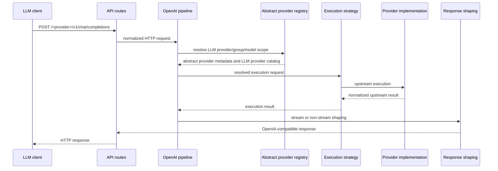
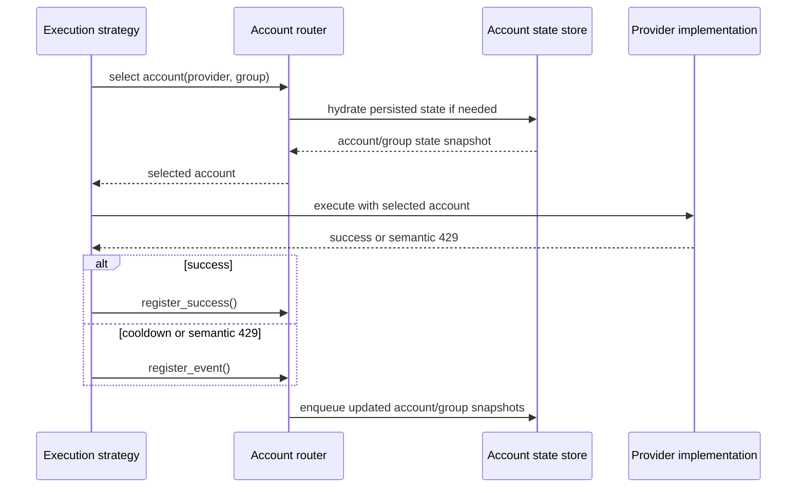
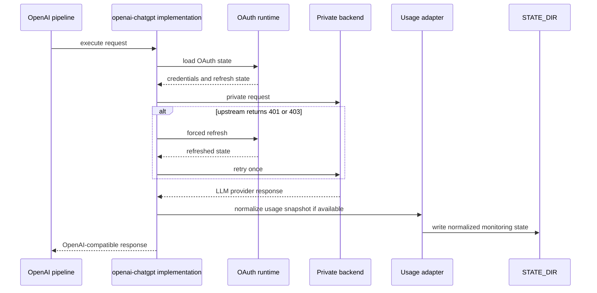
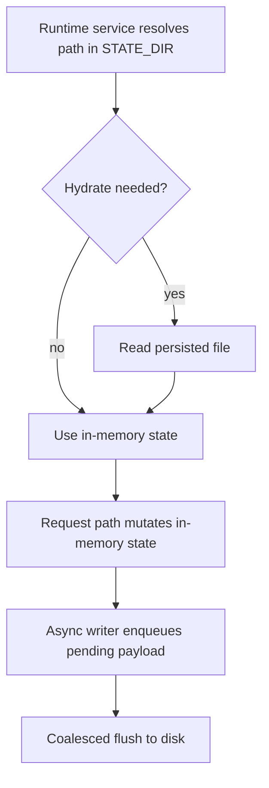

# Runtime Flows

## Назначение

Этот документ фиксирует основные runtime interactions между пакетами и компонентами.

Он дополняет component map и package map sequence-style представлениями.

## 1. LLM provider-scoped OpenAI-compatible request flow

### Scope

- `POST /<provider_name>/v1/chat/completions`
- `POST /<provider_name>/<group_name>/v1/chat/completions`

### Diagram

### Path

1. HTTP request входит в [`llm_agent_platform/api/openai/routes.py`](llm_agent_platform/api/openai/routes.py:1).
2. Route layer передаёт запрос в [`llm_agent_platform/api/openai/pipeline.py`](llm_agent_platform/api/openai/pipeline.py:1).
3. Pipeline строит `ChatRequestContext`, резолвит `LLM provider` namespace, group scope и model visibility.
4. Pipeline выбирает runtime `provider implementation` из [`llm_agent_platform/api/openai/providers/`](llm_agent_platform/api/openai/providers:1).
5. Pipeline выбирает execution strategy из [`llm_agent_platform/api/openai/strategies/`](llm_agent_platform/api/openai/strategies:1).
6. Strategy вызывает `provider implementation` для upstream execution.
7. Stream path использует [`llm_agent_platform/api/openai/streaming.py`](llm_agent_platform/api/openai/streaming.py:1); non-stream path использует [`llm_agent_platform/api/openai/response_shaper.py`](llm_agent_platform/api/openai/response_shaper.py:1).
8. Route layer возвращает `OpenAI-compatible API` response boundary.

### Evidence

- [`docs/architecture/openai-chat-completions-pipeline.md`](docs/architecture/openai-chat-completions-pipeline.md:1)
- [`llm_agent_platform/tests/test_openai_contract.py`](llm_agent_platform/tests/test_openai_contract.py:1)
- [`llm_agent_platform/tests/test_refactor_p2_routes.py`](llm_agent_platform/tests/test_refactor_p2_routes.py:1)

## 2. Quota account selection and rotation flow

### Scope

- quota-based providers in `single` or `rounding` mode

### Diagram

### Path

1. Strategy requests account selection from [`llm_agent_platform/services/account_router.py`](llm_agent_platform/services/account_router.py:1).
2. Router resolves `LLM provider`-local group and available account pool from `LLM provider` accounts-config.
3. Router restores persisted state lazily from [`llm_agent_platform/services/account_state_store.py`](llm_agent_platform/services/account_state_store.py:1) on first access when needed.
4. Upstream execution happens through `provider implementation`.
5. On success strategy calls `register_success()`.
6. On semantic `429` or cooldown signals strategy calls `register_event()`.
7. Router updates in-memory state and enqueues persisted account/group snapshots.

### Evidence

- [`docs/architecture/quota-account-rotation-groups-and-models.md`](docs/architecture/quota-account-rotation-groups-and-models.md:1)
- [`docs/architecture/quota-group-state-snapshot-and-state-dir.md`](docs/architecture/quota-group-state-snapshot-and-state-dir.md:1)
- [`llm_agent_platform/tests/test_quota_account_router.py`](llm_agent_platform/tests/test_quota_account_router.py:1)

## 3. OpenAI ChatGPT auth refresh and usage snapshot flow

### Scope

- `LLM provider` / `provider implementation` `openai-chatgpt`

### Diagram

### Path

1. Pipeline resolves `provider implementation` [`llm_agent_platform/api/openai/providers/openai_chatgpt.py`](llm_agent_platform/api/openai/providers/openai_chatgpt.py:1).
2. Adapter loads runtime OAuth state via [`llm_agent_platform/auth/openai_chatgpt_oauth.py`](llm_agent_platform/auth/openai_chatgpt_oauth.py:1).
3. Adapter executes request against private backend surface как конкретная `provider implementation` для `openai-chatgpt`.
4. If upstream returns `401` or `403`, adapter performs one forced refresh retry and repeats request once.
5. On success adapter normalizes response into `OpenAI-compatible API` shape.
6. Monitoring-only usage snapshot path writes normalized state into `STATE_DIR` through [`llm_agent_platform/services/runtime_state_paths.py`](llm_agent_platform/services/runtime_state_paths.py:1) or the dedicated usage adapter [`llm_agent_platform/services/provider_usage_limits.py`](llm_agent_platform/services/provider_usage_limits.py:1).

### Evidence

- [`docs/providers/openai-chatgpt.md`](docs/providers/openai-chatgpt.md:1)
- [`llm_agent_platform/tests/test_openai_chatgpt_runtime.py`](llm_agent_platform/tests/test_openai_chatgpt_runtime.py:1)

## 4. State [`hydrate`](../terms/project/terms/hydrate.md) and async [`persist`](../terms/project/terms/persist.md) flow

### Scope

- account state, group quota snapshot, `LLM provider`-specific monitoring state

### Diagram

### Path

1. Runtime services resolve state paths inside `STATE_DIR`.
2. Router or `LLM provider`-specific service reads persisted files only to [`hydrate`](../terms/project/terms/hydrate.md) in-memory state after startup or on first access.
3. Request path mutates in-memory state.
4. Persistence layer enqueues writes through shared async writer in [`llm_agent_platform/services/account_state_store.py`](llm_agent_platform/services/account_state_store.py:1).
5. Writer periodically [`persist`](../terms/project/terms/persist.md)-ит `pending[path] = payload` на диск с coalesce semantics.

### Evidence

- [`docs/architecture/quota-group-state-snapshot-and-state-dir.md`](docs/architecture/quota-group-state-snapshot-and-state-dir.md:1)
- [`docs/adr/0019-state-dir-unified-account-state-and-async-writer.md`](docs/adr/0019-state-dir-unified-account-state-and-async-writer.md:1)

## Navigation note

Если требуется больше деталей по конкретному flow, дальше нужно идти так:

- flow -> relevant package in [`docs/architecture/package-map.md`](docs/architecture/package-map.md:1)
- package -> relevant contract or `LLM provider` page via [`docs/architecture/traceability-map.md`](docs/architecture/traceability-map.md:1)
