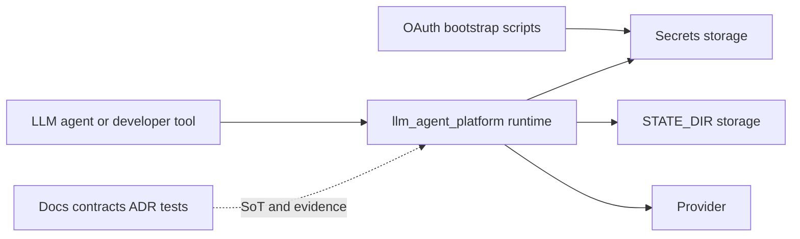

# System Overview

## Назначение

Этот документ даёт high-level представление о системе и задаёт общий zoom-in path для дальнейшей навигации.

В текущем наборе документации `system-overview` фиксирует именно `C4 Context` уровень. Более глубокие уровни вынесены в отдельные focused documents.

## System context

`llm_agent_platform` — provider-centric runtime слой для LLM-агентов и developer tools.

Платформа предоставляет:

- provider-scoped OpenAI-compatible API через `/<provider_name>/v1/*` и `/<provider_name>/<group_name>/v1/*`;
- provider-local catalogs, auth и quota semantics;
- единый runtime path для request routing, account rotation, streaming normalization и error shaping;
- contracts, provider pages и tests как канонический evidence layer.

Общий product canon: [`docs/vision.md`](docs/vision.md:1)

## System boundary

Текущий root runtime — один Flask-based process, собираемый через [`llm_agent_platform/__main__.py`](llm_agent_platform/__main__.py:1).

Внутри него живут:

- provider-scoped OpenAI API routes;
- native provider routes для Gemini;
- parity relay routes;
- provider registry, auth, quota router, runtime state persistence и provider integrations.

## External systems and storage

Подписи на диаграмме:

- `LLM agent or developer tool` — внешний клиент, который использует публичный OpenAI-compatible contract платформы.
- `llm_agent_platform runtime` — основной runtime process этого репозитория.
- `OAuth bootstrap scripts` — локальные scripts, которые получают и обновляют user credentials вне runtime process.
- `Secrets storage` — пользовательские credentials и provider accounts-config.
- `STATE_DIR storage` — mutable runtime state и monitoring artifacts.
- `Provider` — внешняя provider system boundary, к которой обращается платформа.
- `Docs contracts ADR tests` — канонический Source of Truth и evidence layer, который определяет rules, contracts и verification.

В scope текущего runtime `Provider` включает следующие внешние integrations:

- `openai-chatgpt`
- `gemini-cli`
- `google-vertex`
- `qwen-code`

Это внешние systems, а не внутренние части `llm_agent_platform`.

## Архитектурные драйверы

- Provider является основной runtime-сущностью; `model_id` живут в provider-local catalog.
- Route namespace выбирает provider; `model_id` никогда не должен неявно выбирать provider.
- Groups живут внутри provider namespace и изолируют account state.
- Runtime работает по in-memory-first модели; persisted state нужен для restore after restart и audit trail.
- Credentials, declarative config и mutable runtime state являются разными границами хранения и ответственности.
- Публичный OpenAI-compatible contract должен оставаться стабильным, даже если provider-internal semantics богаче.

Ключевые документы rationale:

- [`docs/adr/0020-provider-centric-routing-and-provider-catalogs.md`](docs/adr/0020-provider-centric-routing-and-provider-catalogs.md:1)
- [`docs/adr/0019-state-dir-unified-account-state-and-async-writer.md`](docs/adr/0019-state-dir-unified-account-state-and-async-writer.md:1)
- [`docs/adr/0021-account-centric-provider-monitoring-and-admin-read-model.md`](docs/adr/0021-account-centric-provider-monitoring-and-admin-read-model.md:1)

## Дальнейшая навигация

Этот документ сознательно останавливается на уровне `C4 Context`.

Для следующих уровней детализации нужно идти в отдельные документы:

- container view: [`container-view.md`](./container-view.md)
- layers: [`layers.md`](./layers.md)
- components: [`component-map.md`](./component-map.md)
- runtime interactions: [`runtime-flows.md`](./runtime-flows.md)
- packages: [`package-map.md`](./package-map.md)
- detailed pipeline view: [`openai-chat-completions-pipeline.md`](./openai-chat-completions-pipeline.md)

## Status notes

- OpenAI pipeline, provider-centric routing, registry, auth, quota router и state persistence materialized в runtime code.
- Admin monitoring read-model канонизирован архитектурно, но root runtime admin API materialized не полностью.
- Provider-specific details должны уточняться на страницах в [`docs/providers/`](docs/providers:1).
