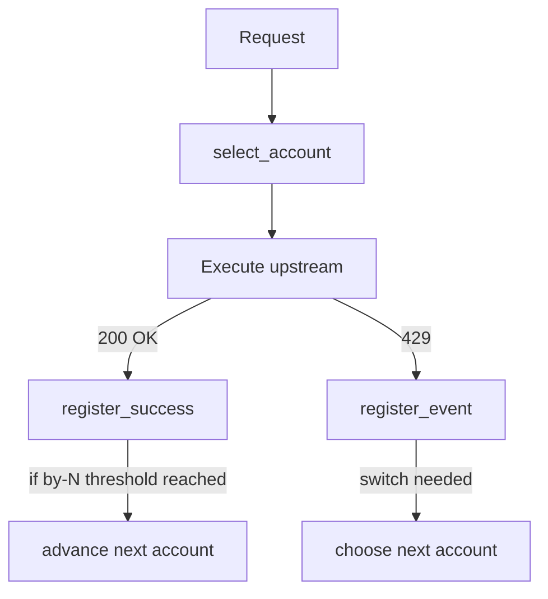
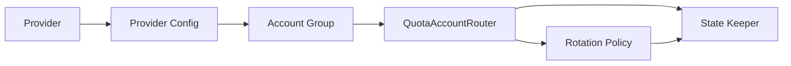

# Архитектура: account rotation policies (random + rotate-by-N)

Связанные задачи:
- [`tasks_descriptions/tasks/015-random-account_rotation.md`](tasks_descriptions/tasks/015-random-account_rotation.md:1)
- [`tasks_descriptions/tasks/016-account-rotation-by-n-queries.md`](tasks_descriptions/tasks/016-account-rotation-by-n-queries.md:1)

Текущая реализация ротации (quota-first): [`services/account_router.py`](services/account_router.py:1).

## 1) Discovery (требования)

### Scope
Только quota-роутинг аккаунтов в режиме `rounding`.

Важно: в текущем коде роутер аккаунтов оперирует строковыми ключами провайдера `gemini` и `qwen` в [`QuotaAccountRouter.select_account()`](services/account_router.py:101).
По смыслу это **пулы аккаунтов** для upstream провайдеров. Решение, которое фиксируем:

- переименовать ключи в коде и конфиге:
  - `gemini` -> `gemini_cli`
  - `qwen` -> `qwen_code`

Это даст единый термин: quota pool id == upstream provider id для quota-контуров.

Также учитываем, что `google_ai_studio` (upstream провайдер с API keys) тоже по сути quota/лимиты и может быть включён в тот же контур ротации как отдельный пул ключей.

### US (User Stories)
- **US-015**: Как оператор прокси, я хочу, чтобы в режиме `rounding` переключение между аккаунтами происходило в случайном порядке (не по порядку в конфиге), чтобы снизить предсказуемость распределения нагрузки между аккаунтами.
  - **AC-015.1**: При `mode=rounding` и включенной random-политике, следующий аккаунт для переключения выбирается случайно из доступных (не exhausted и не cooldown).
  - **AC-015.2**: Текущая политика реакции на `429` сохраняется (switch после порога подряд ошибок/mark exhausted/cooldown) и использует random-выбор только как способ определить *какой* следующий аккаунт выбрать.

- **US-016**: Как оператор прокси, я хочу, чтобы в режиме `rounding` аккаунт обслуживал ровно `N` запросов, после чего прокси переключался на следующий аккаунт, чтобы равномернее распределять нагрузку.
  - **AC-016.1**: После `N` *успешных* запросов на одном аккаунте, следующий запрос должен выбирать следующий аккаунт (по порядку `all_accounts`).
  - **AC-016.2**: Если на аккаунте возникает `429` два раза подряд (по текущей классификации quota_exhausted), аккаунт считается exhausted и исключается из выбора до reset window (как сейчас).
  - **AC-016.3**: `429`-логика остаётся в силе и имеет приоритет над by-N (если by-N выбрал аккаунт, но тот на cooldown/exhausted, выбирается следующий доступный).

### NFR (качества)
- **NFR-015/016.1**: Backward compatibility — при отсутствии новых ключей в конфиге поведение должно остаться текущим.
- **NFR-015/016.2**: Потокобезопасность — счётчики/состояние не должны ломаться при параллельных запросах.
  - Базовая реализация: защищаем изменение state локом (как сейчас) и допускаем best-effort семантику (без строгого exactly-N при гонках), но без исключений/коррупции.
  - Ожидаемая эксплуатационная модель (от владельца): в дальнейшем планируется ввод *групп аккаунтов* (1 агент на 1 группу), чтобы не было конкурентных запросов, меняющих счётчики внутри одной группы.
- **NFR-015/016.3**: Observability — логирование переключений должно содержать trigger (RANDOM_SWITCH | BY_N | RATE_LIMIT | QUOTA_EXHAUSTED) и имя аккаунта.

### CONS (ограничения)
- **CONS-1**: Не менять OpenAI-compatible контракт; изменения только в выборе аккаунта (внутреннее поведение).
- **CONS-2**: Источник конфигурации — файлы `*_accounts_config.json`, формат совместим с существующими примерами: [`docs/examples/gemini_accounts_config.example.json`](docs/examples/gemini_accounts_config.example.json:1), [`docs/examples/qwen_accounts_config.example.json`](docs/examples/qwen_accounts_config.example.json:1).

### OQ (открытые вопросы)
- **OQ-1**: Комбинации политик. Решение: все опции комбинируемы одновременно:
  - 429 и её параметры,
  - random (on/off),
  - by-N (on/off) и N.
- **OQ-2**: Группы аккаунтов (future): потребуется ли реализовать группировку уже сейчас, или это отдельная задача? (В текущем scope — нет, только закладываем расширяемость.)

## 2) Предлагаемое изменение конфигурации (contract of config)

Расширяем accounts-config (например [`docs/examples/qwen_accounts_config.example.json`](docs/examples/qwen_accounts_config.example.json:1)):

1) **Группы аккаунтов** (для изоляции state/счётчиков 1 агент = 1 группа)

Предлагаемый формат (вариант, обсуждаемый):

```json
{
  "mode": "rounding",
  "active_account": "acct-1",
  "all_accounts": ["acct-1", "acct-2", "acct-3", "acct-4", "acct-5", "acct-6"],
  "groups": {
    "g1": {
      "accounts": ["acct-1", "acct-2", "acct-3"],
      "models": ["qwen-coder-model-quota"]
    },
    "g2": {
      "accounts": ["acct-4", "acct-5", "acct-6"],
      "models": ["qwen-coder-model-quota"]
    }
  },
  "rotation_policy": {
    "random_order": true,
    "rotate_after_n_successes": 10,
    "rate_limit_threshold": 2,
    "quota_exhausted_threshold": 2,
    "rate_limit_cooldown_seconds": 5
  }
}
```

Замечания:
- `groups` задаются **внутри каждого provider accounts-config** отдельно (у `gemini_cli` одни, у `qwen_code` другие), работают независимо.
- `all_accounts` остаётся каноническим списком декларации аккаунтов, а `groups` — view/разбиение.

Режим по умолчанию:
- если `groups` отсутствует — подразумеваем одну группу `g0`, эквивалентную `all_accounts`, а URL остаётся каноническим: `http://localhost:4000/v1/*`.
- если `groups` присутствует — добавляются префиксные маршруты (вариант B ниже): `http://localhost:4000/g1/v1/*`, `http://localhost:4000/g2/v1/*`.

2) **Стратегии ротации** в `rotation_policy` (комбинируемые):

- `rotation_policy.random_order`: bool (default: false)
- `rotation_policy.rotate_after_n_successes`: int (default: 0 = выключено)

Пример (фрагмент):
```json
{
  "rotation_policy": {
    "rate_limit_threshold": 2,
    "quota_exhausted_threshold": 2,
    "rate_limit_cooldown_seconds": 5,
    "random_order": true,
    "rotate_after_n_successes": 10
  }
}
```

Семантика комбинаций (зафиксировано от владельца):
- 429 логика остаётся и применяется всегда.
- `random_order=true` влияет на порядок/выбор следующего аккаунта при переключениях в rounding.
- `rotate_after_n_successes>0` включает by-N: выбранный аккаунт обслуживает N успешных запросов, затем происходит переключение.
- Если на аккаунте встречается `429` два раза подряд (quota_exhausted по текущей классификации), аккаунт считается exhausted и исключается до reset window.
- `rate_limit` в by-N: текущий аккаунт переводим в cooldown и переключаемся на следующий доступный.
- Если **все** аккаунты в cooldown: поведение (зафиксировано): **не ждать**, а возвращать ошибку вида `all_accounts_on_cooldown please wait <seconds>` где `<seconds>` — время до ближайшего аккаунта, выходящего из cooldown.
  - Это не блокирует worker и сохраняет прозрачность для клиента.
  - Для OpenAI-compatible shape: это `429 upstream_error` с message, содержащим `please wait <seconds>`.

Открытое место для решения: как учитывать `rate_limit` vs `quota_exhausted` в by-N (в этом плане по умолчанию: by-N считает только успехи, а 429 логика управляет исключением аккаунтов).

## 3) Изменения в доменной модели/состоянии

Модуль: [`services/account_router.py`](services/account_router.py:1)

- Расширить [`ProviderConfig`](services/account_router.py:37) новыми полями:
  - `rounding_switch_strategy: str`
  - `rotate_after_n_successes: int`

- Расширить [`_ProviderState`](services/account_router.py:59):
  - `successes_on_account: dict[str, int]` (кол-во успешных запросов на аккаунте с момента последнего by-N switch)

Семантика by-N:
- Инкремент счётчика выполняется в [`QuotaAccountRouter.register_success()`](services/account_router.py:164).
- Когда счётчик достигает `N`, роутер заранее устанавливает следующий аккаунт (через существующую механику next_index / выбор следующего доступного), и сбрасывает счётчик для текущего аккаунта.

Семантика random:
- Когда требуется выбрать *следующий* аккаунт (switch из-за 429/недоступности/перехода по by-N), выбор следующего кандидата выполняется:
  - `sequential`: как сейчас (следующий по `all_accounts`).
  - `random`: случайно среди доступных кандидатов (исключая текущий), с учётом exhausted/cooldown.

### 3.1) Future extension: группы аккаунтов

Текущее состояние хранится по ключу `provider` в [`QuotaAccountRouter`](services/account_router.py:88). Для поддержки «1 агент на 1 группу» логичным развитием будет:

- ключ состояния: `(provider, group_id)` вместо только `provider`;
- `group_id` задаётся либо через дополнительный ключ в provider-config, либо через входной параметр запроса (например header), а strategies прокидывают его в `select_account()`.

Это сознательно **не** входит в реализацию задач 015/016, но влияет на NFR по конкурентности.

## 4) Точки интеграции в существующую архитектуру

- `select_account()` вызывается из strategies:
  - [`api/openai/strategies/rotate_on_429_rounding.py`](api/openai/strategies/rotate_on_429_rounding.py:1)
- Результаты успеха/ошибок уже регистрируются:
  - `register_event()` на 429
  - `register_success()` на успех

Важно: by-N реализуется без изменения strategies, через расширение логики `register_success()`.

## 5) Потоки (Mermaid)



## 6) План тестирования

Обновить/добавить тесты уровня L1 (router unit): [`tests/test_quota_account_router.py`](tests/test_quota_account_router.py:1)
- TC-RAND-1: при random стратегии переключение после порога 429 выбирает аккаунт не по фиксированному next (детерминировать через patch random choice).
- TC-N-1: при `rotate_after_n_successes=N` после N `register_success()` следующий `select_account()` возвращает следующий аккаунт.
- TC-N-2: при 429 quota_exhausted два раза подряд аккаунт помечается exhausted как сейчас.

Дополнительно: обновить примеры конфигов в документации.

## 7) Миграция/совместимость

- Новые ключи опциональны.
- Значения по умолчанию сохраняют текущее поведение.

## 8) Изменяемые файлы (ожидаемо)

- Код:
  - [`services/account_router.py`](services/account_router.py:1)
- Тесты:
  - [`tests/test_quota_account_router.py`](tests/test_quota_account_router.py:1)
- Документация:
  - [`docs/examples/gemini_accounts_config.example.json`](docs/examples/gemini_accounts_config.example.json:1)
  - [`docs/examples/qwen_accounts_config.example.json`](docs/examples/qwen_accounts_config.example.json:1)
  - (опционально) [`docs/testing/suites/quota-account-rotation.md`](docs/testing/suites/quota-account-rotation.md:1)

## 9) Acceptance checklist (DoD)

- [ ] Конфиг расширен и совместим назад.
- [ ] Random стратегия влияет на выбор следующего аккаунта при switch.
- [ ] By-N стратегия переключает после N успешных запросов.
- [ ] Тесты покрывают обе стратегии.
- [ ] `uv run python -m unittest discover -s tests -p test_*.py` проходит.

---

## 12) Варианты выбора группы для агента: A vs B (плюсы/минусы)

Ключевое ограничение от владельца: клиентское ПО **не знает**, где «агент 1»/«агент 2», и **не может** посылать специальные заголовки. Значит, выбор группы должен происходить через endpoint/base_url, который агент сам задаёт в своей конфигурации.

### Вариант A — 1 группа = 1 инстанс прокси (контейнер/порт)

Идея:
- Поднимаем 2 сервиса (или 2 compose-профиля) с разными портами:
  - `http://localhost:4001/v1/*` (группа g1)
  - `http://localhost:4002/v1/*` (группа g2)
- Внутри каждого инстанса прокси настроена «своя» группа по умолчанию через ENV (например `DEFAULT_GROUP_ID=g1`).

Плюсы:
- Максимальная изоляция state/счетчиков: разные процессы, нет shared-memory.
- Ничего не меняем в OpenAI-compatible пути (`/v1/...` сохраняются).
- Минимум изменений в роутинге Flask.
- Упрощает будущий горизонтальный scaling.

Минусы:
- Операционная сложность: больше сервисов/портов, деплой/мониторинг/логи размножаются.
- Дублирование конфигурации окружения между сервисами.
- Если нужно делить одни и те же secrets/volume — становится сложнее в управлении.

### Вариант B — 1 инстанс прокси, разные url_prefix для групп (ВЫБРАНО)

Идея:
- Один процесс Flask, но разные префиксы:
  - `http://localhost:4000/g1/v1/*`
  - `http://localhost:4000/g2/v1/*`
- Префикс определяет `group_id` (g1/g2) без header.

Плюсы:
- Один контейнер/порт.
- Проще централизовать логи/метрики и деплой.
- Удобно добавлять группы без дополнительных сервисов.

Минусы:
- Потребуется изменить маршрутизацию (добавить префикс в blueprints или добавить wrapper routes).
- Не все клиенты любят нестандартный base path (хотя base_url можно задать).
- Нужно явно решить, как будет выглядеть `/v1/models` (дублировать под `/g1/v1/models` и `/g2/v1/models`, либо оставить общий).

### Сводная таблица

| Критерий | Вариант A | Вариант B |
|---|---|---|
| Изоляция state | сильная (процессы) | логическая (ключи state) |
| Совместимость путей `/v1/*` | максимальная | требуется префикс `/gX` |
| Операционная сложность | выше | ниже |
| Изменения в коде роутов | меньше | больше |

### Зафиксированный выбор

Выбран Вариант B.

Дополнение: endpoint [`/v1/models`](api/openai/routes.py:35) должен стать group-aware, т.к. разным группам/аккаунтам могут быть доступны разные модели.
Решение: список моделей для группы хранить в accounts-config внутри `groups.<gid>.models`.

---

## 10) Модель сущностей и ответственности (design model)

Ниже — целевая декомпозиция ответственности. Сейчас часть этих ролей слеплена внутри [`QuotaAccountRouter`](services/account_router.py:88); задачи 015/016 можно реализовать минимально-инвазивно, но модель поможет корректно спроектировать extension для групп.

### 10.1 Сущности

1) **Provider**
- Идентификатор: `gemini` | `qwen`.
- Определяет:
  - какой accounts-config файл читать,
  - какие типы аккаунтов валидировать (GeminiAccount vs BaseAccount).

2) **Account Group** (группа аккаунтов)
- Идентификатор: `group_id` (строка), например `agent-1`, `agent-2`.
- Содержит `accounts_pool` (упорядоченный список имён аккаунтов) и `active_account` (опционально как стартовая точка).
- Семантика: *все счетчики/состояния ротации ведутся в пределах (provider, group_id)*.

3) **Rotation Policy** (политика/стратегия выбора следующего аккаунта)
- Комбинируемые флаги (по вашему решению):
  - 429-политика (существующая): пороги, cooldown/exhausted.
  - random: on/off.
  - by-N: on/off и N.
- В терминах реализации это может быть:
  - либо единая стратегия, которая учитывает все флаги,
  - либо композиция нескольких стратегий (лучше для расширяемости).

4) **State/Stats Keeper** (хранитель состояния)
- Хранит runtime state (в памяти процесса) по ключу `RouterKey=(provider, group_id)`:
  - pointer/next_index (куда переключаться),
  - consecutive errors per account,
  - cooldown/exhausted markers,
  - counters для by-N (successes per account или per current-account).

5) **QuotaAccountRouter**
- Публичный фасад, который вызывают стратегии из OpenAI/Gemini роутов.
- Обязанности:
  - (а) выбрать аккаунт: `select_account(provider, model, group_id)`
  - (б) зарегистрировать события/успех: `register_event(...)`, `register_success(...)`
- Внутри использует Config + Policy + StateKeeper.

### 10.2 Связи



## 11) Как будут работать 2 агента с 2 группами (пример)

### Setup

- Provider: `qwen`
- Группа `agent-1`:
  - `all_accounts=[acct-1, acct-2, acct-3]`
- Группа `agent-2`:
  - `all_accounts=[acct-4, acct-5, acct-6]`

### Поток запросов

1) Агент 1 делает запрос (group_id=`agent-1`)
- [`api/openai/pipeline.build_request_context()`](api/openai/pipeline.py:83) читает `group_id` из headers/body (предлагаемый контракт ниже).
- Strategy вызывает `select_account(provider=qwen, model=..., group_id=agent-1)`.
- Router берёт state только для ключа `(qwen, agent-1)`.

2) Агент 2 делает запрос (group_id=`agent-2`)
- Всё аналогично, но state ключ `(qwen, agent-2)`.

Итог:
- счётчики by-N, exhausted/cooldown и next_index изолированы;
- даже при параллельных запросах от разных агентов — они не конкурируют за один и тот же state.

### Предлагаемый request-level контракт для group_id (future, отдельной задачей)

Чтобы маршрутизатор понимал, к какой группе относится запрос, нужен идентификатор группы в запросе.

Вариант A (рекомендуемый): HTTP header
- `X-Quota-Group: agent-1`

Вариант B: поле в body
- `account_group": "agent-1"` (для OpenAI-compatible /v1/chat/completions)

Default:
- если не задано — `group_id=default`.

Примечание: это изменение не входит в 015/016, но архитектурно совместимо с их реализацией.
