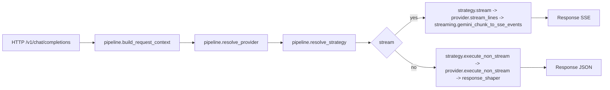

# Архитектура P1: модульная декомпозиция OpenAI chat_completions

## Контекст
Задача: рефакторинг [`chat_completions()`](api/openai/routes.py:1009) с декомпозицией на pipeline‑слои, устранением дублирования stream chunk‑mapping и введением явного разделения:

- **Provider** = интеграция с конкретной логикой вызова LLM (base url + формат запросов/ответов + креды).
- **Strategy** = стратегия выполнения запросов поверх Provider (включая выбор аккаунта, ротацию, retry/fallback политики).

Это согласовано с будущими расширениями: [`tasks_descriptions/tasks/015-random-account_rotation.md`](tasks_descriptions/tasks/015-random-account_rotation.md:1), [`tasks_descriptions/tasks/016-account-rotation-by-n-queries.md`](tasks_descriptions/tasks/016-account-rotation-by-n-queries.md:1), [`tasks_descriptions/tasks/017-google-ai-studio-integration.md`](tasks_descriptions/tasks/017-google-ai-studio-integration.md:1).

## Цели
- Упростить [`chat_completions()`](api/openai/routes.py:1009) до роли оркестратора.
- Изолировать provider‑specific логику (разные LLM интеграции, включая разные интеграции одного вендора Google).
- Изолировать стратегии выполнения/ротации аккаунтов так, чтобы они были переиспользуемы между провайдерами.
- Переиспользовать общий mapping для stream‑ответов Gemini и Vertex.
- Сохранить OpenAI‑compatible контракт и quota‑first поведение.

## Предлагаемая структура модулей

### 1) Оркестрация пайплайна
**Файл:** [`api/openai/pipeline.py`](api/openai/pipeline.py:1)
- `build_request_context()` — парсинг запроса и подготовка `ChatRequestContext` (перенос логики из `_build_chat_request_context`).
- `resolve_provider()` — выбор Provider по `ctx`.
- `resolve_strategy()` — выбор Strategy по `ctx` и/или по конфигу provider‑аккаунтов.
- `handle_non_stream()` — единый non‑stream pipeline: prepare → execute → shape.
- `handle_stream()` — единый stream pipeline: prepare → stream → mapping → usage → DONE.

### 2) Providers (интеграции LLM)
**Папка:** [`api/openai/providers/`](api/openai/providers/:1)

- [`api/openai/providers/base.py`](api/openai/providers/base.py:1)
  - Протокол `Provider`:
    - `id` (например `google_vertex`, `gemini_cli`, `google_ai_studio`, `qwen_code`).
    - Creds разделены на 2 этапа:
      - **Credential Acquisition (bootstrap, вне контейнера)**
        - Создание файлов с кредами через локальные скрипты.
        - Gemini CLI: [`scripts/get_oauth_credentials.py`](scripts/get_oauth_credentials.py:1)
        - Qwen Code: [`scripts/get_qwen_oauth_credentials.py`](scripts/get_qwen_oauth_credentials.py:1)
        - Этот этап не является частью runtime Provider интерфейса.
      - **Runtime Credentials Use (в контейнере)**
        - `load_runtime_credentials(account) -> ProviderRuntimeCreds` (прочитать файл creds, при необходимости refresh).
        - `prepare_upstream(ctx, runtime_creds) -> UpstreamRequestContext` (сформировать headers/url/payload).
    - `execute_non_stream(ctx, upstream) -> tuple[dict | str, int]` или возвращение `httpx.Response` (деталь реализации согласуем в Code).
    - `stream_lines(ctx, upstream) -> Iterator[str] | Iterator[bytes]`.

  - Примечание по политике окружения: разделение «bootstrap получения creds» и «runtime использования creds» должно соответствовать ADR env split (см. [`docs/adr/0015-env-separation-runtime-vs-oauth-bootstrap.md`](docs/adr/0015-env-separation-runtime-vs-oauth-bootstrap.md:1)).

- [`api/openai/providers/google_vertex.py`](api/openai/providers/google_vertex.py:1)
  - Логика вызова Vertex API (сервисный аккаунт), ранее `_prepare_vertex_upstream`.

- [`api/openai/providers/gemini_cli.py`](api/openai/providers/gemini_cli.py:1)
  - Логика quota‑транспорта через Cloud Code endpoint, ранее `_prepare_gemini_quota_upstream` + `send_generate`/`stream_generate_lines`.
  - Credential Acquisition: [`scripts/get_oauth_credentials.py`](scripts/get_oauth_credentials.py:1) создаёт файл creds.
  - Runtime Credentials Use: чтение файла creds + bearer token (и refresh, если потребуется по текущей реализации).

- [`api/openai/providers/qwen_code.py`](api/openai/providers/qwen_code.py:1)
  - Логика Qwen Code OAuth, ранее `_prepare_qwen_quota_upstream` + `send_generate_to_url`/`stream_generate_lines_from_url`.
  - Credential Acquisition: [`scripts/get_qwen_oauth_credentials.py`](scripts/get_qwen_oauth_credentials.py:1) создаёт файл creds.
  - Runtime Credentials Use:
    - refresh через [`refresh_qwen_credentials_file()`](auth/qwen_oauth.py:1)
    - построение `Authorization: Bearer` и `resource_url`.

- [`api/openai/providers/google_ai_studio.py`](api/openai/providers/google_ai_studio.py:1)
  - Будущий Provider для Gemini API keys (задача [`tasks_descriptions/tasks/017-google-ai-studio-integration.md`](tasks_descriptions/tasks/017-google-ai-studio-integration.md:1)).
  - Creds: только runtime‑использование `api_key` (без файлового acquisition и без refresh).

### 3) Strategies (политики выполнения и ротации)
**Папка:** [`api/openai/strategies/`](api/openai/strategies/:1)

- [`api/openai/strategies/base.py`](api/openai/strategies/base.py:1)
  - Протокол `ExecutionStrategy`:
    - `select_account(ctx, provider) -> AccountRef | None`.
    - `execute_non_stream(ctx, provider) -> tuple[str, int]`.
    - `stream(ctx, provider) -> Iterator[str]`.

- [`api/openai/strategies/single_account.py`](api/openai/strategies/single_account.py:1)
  - Стратегия без ротации (один активный аккаунт).

- [`api/openai/strategies/rotate_on_429_rounding.py`](api/openai/strategies/rotate_on_429_rounding.py:1)
  - Текущая политика: ротация при семантических 429 (RATE_LIMIT/QUOTA_EXHAUSTED) в режиме rounding.
  - Использует существующий роутер [`QuotaAccountRouter`](services/account_router.py:88) как реализацию выбора аккаунта.

- [`api/openai/strategies/random_rotation.py`](api/openai/strategies/random_rotation.py:1)
  - Будущая стратегия: случайная ротация (задача [`tasks_descriptions/tasks/015-random-account_rotation.md`](tasks_descriptions/tasks/015-random-account_rotation.md:1)).

- [`api/openai/strategies/rotation_by_n_queries.py`](api/openai/strategies/rotation_by_n_queries.py:1)
  - Будущая стратегия: ротация после N запросов (задача [`tasks_descriptions/tasks/016-account-rotation-by-n-queries.md`](tasks_descriptions/tasks/016-account-rotation-by-n-queries.md:1)).

### 4) Общий streaming‑mapping
**Файл:** [`api/openai/streaming.py`](api/openai/streaming.py:1)
- `parse_vertex_stream_line()` — общая парсилка line‑формата.
- `gemini_chunk_to_sse_events()` — общий Gemini‑chunk → SSE mapping (quota/vertex).
- `build_usage_stream_chunk()` — единый usage‑chunk (если `include_usage`).

### 5) Формирование non‑stream ответа
**Файл:** [`api/openai/response_shaper.py`](api/openai/response_shaper.py:1)
- `shape_gemini_nonstream_response()` — общий shaping non‑stream для quota и vertex.

## Ответственности и границы
- [`api/openai/routes.py`](api/openai/routes.py:1) — только маршрут и вызов пайплайна.
- Providers и Strategies не зависят от Flask (используют только контексты/transport).
- [`api/openai/streaming.py`](api/openai/streaming.py:1) не знает о провайдерах.
- [`api/openai/response_shaper.py`](api/openai/response_shaper.py:1) не знает о провайдерах.

## Поток данных (Mermaid)

## Миграция функций из routes.py
- `_build_chat_request_context` → `pipeline.build_request_context`.
- `_prepare_*_upstream` → Providers (`google_vertex`, `gemini_cli`, `qwen_code`).
- `_gemini_chunk_to_sse_events`, `_build_usage_stream_chunk`, `_parse_vertex_stream_line` → `streaming`.
- `_shape_gemini_nonstream_response` → `response_shaper`.

## Ожидаемые эффекты
- Читаемость: `chat_completions()` становится тонким.
- Расширяемость: новые LLM интеграции добавляются отдельным Provider.
- Расширяемость: новые политики ротации/выполнения добавляются отдельной Strategy.
- Поддерживаемость: меньше дублирования, единые маппинги.

## Ограничения и совместимость
- Внешний OpenAI‑контракт не меняется.
- Quota‑first логика сохраняется.
- Потоки SSE и usage‑chunk остаются совместимыми с текущими тестами.

## Открытые вопросы
- Нужен ли отдельный `response_shaper.py` или оставить внутри `pipeline.py`?
- Нужна ли отдельная стратегия для `strict_cli_parity` поведения (fallback цепочки)?
