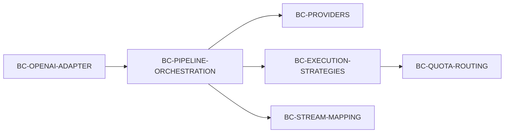
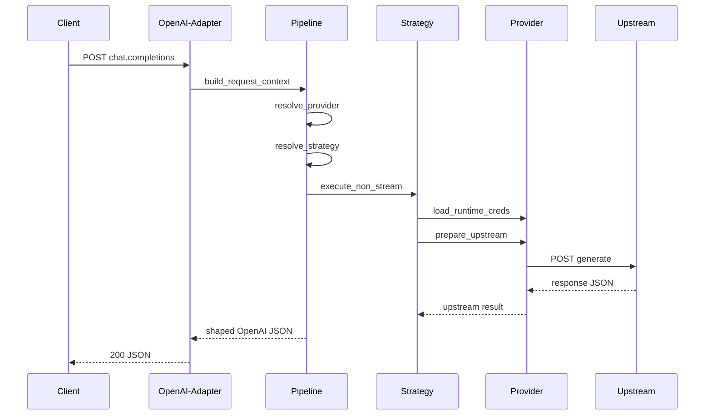
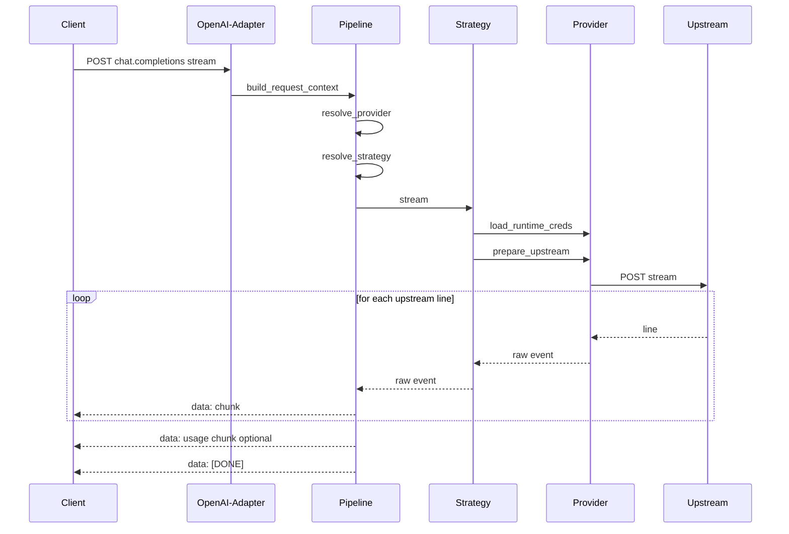

# Domain Model (P1): OpenAI chat_completions pipeline + Providers + Strategies

Связанный документ архитектуры: [`plans/018-refactor-p1-architecture.md`](plans/018-refactor-p1-architecture.md)

## Scope
Доменная модель описывает семантику и границы ответственности для рефакторинга P1 вокруг [`chat_completions()`](api/openai/routes.py:1009): пайплайн обработки запроса, стратегии провайдеров, stream/non-stream shaping, и взаимодействие с квотным роутером.

## Glossary
- **OpenAI Contract**: внешний HTTP API `/v1/chat/completions` и формат ответов (JSON или SSE).
- **ChatCompletionRequest**: входной JSON с `model`, `messages`, `stream` и опциональными параметрами.
- **ChatRequestContext**: нормализованный внутренний контекст запроса (см. `ChatRequestContext` в [`api/openai/routes.py`](api/openai/routes.py:131)).
- **Upstream**: внешний провайдерный endpoint, куда прокси отправляет запрос.
- **UpstreamRequestContext**: нормализованный контекст вызова upstream (см. `UpstreamRequestContext` в [`api/openai/routes.py`](api/openai/routes.py:148)).
- **Provider**: код для работы с моделью провайдера + base url + креды для него.
  - Примеры provider id: `google_vertex`, `gemini_cli`, `google_ai_studio`, `qwen_code`.
- **Strategy**: стратегия выполнения запросов с использованием какого-либо Provider.
  - Включает: выбор аккаунта, ротацию, retry/fallback политики.
  - Должна быть переиспользуемой между разными Providers.
- **Credential Acquisition (bootstrap)**: создание файлов с кредами через локальные скрипты.
  - Gemini CLI: [`scripts/get_oauth_credentials.py`](scripts/get_oauth_credentials.py:1)
  - Qwen Code: [`scripts/get_qwen_oauth_credentials.py`](scripts/get_qwen_oauth_credentials.py:1)
- **Runtime Credentials Use**: использование creds в контейнере для построения headers/url/payload.
  - Чтение creds файла, refresh при необходимости, построение `Authorization`.
- **Quota Mode**: режим, когда `raw_model` содержит `quota` (см. [`_is_gemini_quota_model()`](api/openai/routes.py:53) и [`_is_qwen_quota_model()`](api/openai/routes.py:49)).
- **Vertex Mode**: режим без quota, вызов Vertex AI.
- **SSE Stream**: поток строк вида `data: <json>\n\n` и терминатор `data: [DONE]`.
- **Chunk**: один элемент OpenAI stream (`chat.completion.chunk`).
- **Usage chunk**: финальный stream chunk с `usage`, если requested (см. [`_build_usage_stream_chunk()`](api/openai/routes.py:569)).
- **Account Rotation**: переключение quota-аккаунта при семантических 429 (RATE_LIMIT / QUOTA_EXHAUSTED).

## Bounded Contexts (BC)

### BC-OPENAI-ADAPTER
**Ответственность**: принять запрос, вызвать доменный пайплайн, вернуть ответ в OpenAI-формате.
- Точка входа: [`chat_completions()`](api/openai/routes.py:1009).

### BC-PIPELINE-ORCHESTRATION
**Ответственность**: последовательность шагов (parse/validate → strategy selection → upstream execution → response shaping).
- Будущий модуль: `pipeline` по плану из [`plans/018-refactor-p1-architecture.md`](plans/018-refactor-p1-architecture.md).

### BC-PROVIDERS
**Ответственность**: конкретная интеграция LLM.

Provider включает:
- base url + формат запросов/ответов,
- Runtime Credentials Use,
- транспорт (non-stream + stream).

Credential Acquisition для провайдеров с OAuth выполняется отдельными локальными скриптами (вне контейнера):
- Gemini CLI: [`scripts/get_oauth_credentials.py`](scripts/get_oauth_credentials.py:1)
- Qwen Code: [`scripts/get_qwen_oauth_credentials.py`](scripts/get_qwen_oauth_credentials.py:1)

Примеры:
- `google_vertex`: runtime получение SA токена через [`get_vertex_token()`](auth/credentials.py:1) и вызов Vertex API.
- `gemini_cli`: quota transport через [`build_quota_payload()`](services/quota_transport.py:33), Runtime Credentials Use через bearer token (creds файл создаётся bootstrap-скриптом).
- `qwen_code`: Runtime Credentials Use через bearer token + `resource_url` (creds файл создаётся bootstrap-скриптом, refresh выполняется через [`refresh_qwen_credentials_file()`](auth/qwen_oauth.py:1)).
- `google_ai_studio`: только Runtime Credentials Use (API key), без refresh.

Примечание: разделение bootstrap и runtime окружения должно соответствовать ADR [`docs/adr/0015-env-separation-runtime-vs-oauth-bootstrap.md`](docs/adr/0015-env-separation-runtime-vs-oauth-bootstrap.md:1).

### BC-EXECUTION-STRATEGIES
**Ответственность**: стратегия выполнения запросов поверх Provider.

Strategy включает:
- выбор аккаунта,
- ротацию (в т.ч. будущие: random, by N queries),
- обработку семантических 429 и retry,
- fallback chain правила.

Связанные будущие задачи:
- random rotation: [`tasks_descriptions/tasks/015-random-account_rotation.md`](tasks_descriptions/tasks/015-random-account_rotation.md:1)
- rotation by N queries: [`tasks_descriptions/tasks/016-account-rotation-by-n-queries.md`](tasks_descriptions/tasks/016-account-rotation-by-n-queries.md:1)

### BC-STREAM-MAPPING
**Ответственность**: преобразование upstream stream событий в OpenAI SSE chunks.
- Текущие функции: [`_convert_gemini_stream_chunk()`](api/openai/routes.py:191), [`_gemini_chunk_to_sse_events()`](api/openai/routes.py:553), [`_parse_vertex_stream_line()`](api/openai/routes.py:535).

### BC-QUOTA-ROUTING
**Ответственность**: выбор quota-аккаунта, регистрация событий 429 и успехов.
- Основной сервис: [`QuotaAccountRouter`](services/account_router.py:88).

## Entities and Invariants

### Entity: ChatRequestContext
Источник: `ChatRequestContext` в [`api/openai/routes.py`](api/openai/routes.py:131).

Ключевые поля:
- `raw_model` и `target_model` (после [`map_model_name()`](core/models.py:1)).
- `stream` и `include_usage`.
- `contents` и `system_instruction` после [`transform_openai_to_gemini()`](api/openai/transform.py:3).
- `is_qwen_quota_mode`, `is_gemini_quota_mode`, `is_quota_mode`.

Инварианты:
- `is_quota_mode == (is_qwen_quota_mode or is_gemini_quota_mode)`.
- `include_usage` имеет смысл только если `stream == True`.
- `contents` должен быть JSON‑серилизуемым после [`sanitize_data()`](core/utils.py:1).

### Entity: UpstreamRequestContext
Источник: `UpstreamRequestContext` в [`api/openai/routes.py`](api/openai/routes.py:148).

Ключевые поля:
- `url`, `headers`, `params`.
- `payload` — upstream request body.
- `selected_account` — только для quota режимов.

Инварианты:
- Для quota стратегий `selected_account` должен быть задан (кроме случаев fail-fast подготовки).
- Для Vertex `selected_account == None`.

### Entity: Provider
Сущность, инкапсулирующая специфику интеграции с LLM.

Инварианты:
- Provider не содержит политики ротации (это обязанность Strategy).
- Provider отвечает за Runtime Credentials Use.
- Provider может опираться на bootstrap creds файлы, созданные через [`scripts/get_oauth_credentials.py`](scripts/get_oauth_credentials.py:1) и [`scripts/get_qwen_oauth_credentials.py`](scripts/get_qwen_oauth_credentials.py:1).

### Entity: Strategy
Сущность, инкапсулирующая политики выполнения запросов поверх Provider.

Инварианты:
- Strategy не зависит от Flask объектов (`request`, `Response`).
- Strategy работает через Provider API и не вшивает провайдерную специфику напрямую.
- Strategy может быть переиспользована для разных Providers.

### Entity: StreamEvent
Представление одного upstream stream сообщения.

Варианты:
- Quota Gemini/Qwen: строки, парсящиеся через [`parse_cloud_code_sse_line()`](services/quota_transport.py:151) или Qwen `data: {...}`.
- Vertex: строки, парсящиеся через [`_parse_vertex_stream_line()`](api/openai/routes.py:535).

Инварианты:
- В случае нормального завершения stream обязан иметь терминатор `data: [DONE]`.
- Если запрошен usage chunk, он эмитится перед `data: [DONE]`.

### Entity: AccountRouter State
Источник: [`QuotaAccountRouter`](services/account_router.py:88) и `SelectedAccount` в [`services/account_router.py`](services/account_router.py:50).

Инварианты:
- В режиме `rounding` событие 429 (RATE_LIMIT или QUOTA_EXHAUSTED) может привести к:
  - retry_same,
  - switch_account,
  - all_exhausted,
  - all_cooldown.
- Успешный запрос обязан сбрасывать счётчики ошибок для аккаунта через [`register_success()`](services/account_router.py:164).

## Domain Events (EV)
- EV-REQUEST-RECEIVED: вход запроса в OpenAI adapter.
- EV-PROVIDER-RESOLVED: выбран Provider.
- EV-STRATEGY-RESOLVED: выбрана Strategy.
- EV-CREDS-FILE-CREATED: создан bootstrap creds файл (вне контейнера, через scripts).
- EV-RUNTIME-CREDS-LOADED: runtime creds прочитаны и готовы к использованию.
- EV-UPSTREAM-CALL-STARTED: отправка запроса upstream.
- EV-UPSTREAM-STREAM-CHUNK: получен upstream chunk.
- EV-UPSTREAM-429-RATE_LIMIT: классификация 429 как RATE_LIMIT (см. [`classify_429_response()`](services/quota_transport.py:200)).
- EV-UPSTREAM-429-QUOTA_EXHAUSTED: классификация 429 как QUOTA_EXHAUSTED.
- EV-ACCOUNT-ROTATION-SWITCH: принято решение о переключении аккаунта.
- EV-UPSTREAM-SUCCESS: успешный ответ, регистрация успеха.
- EV-POLICY-VIOLATION: Gemini safety/recitation блокировки (см. [`_convert_gemini_stream_chunk()`](api/openai/routes.py:191) и [`_shape_gemini_nonstream_response()`](api/openai/routes.py:597)).

## Key Models for Contract-First
Список моделей, которые полезно считать ключевыми для контрактов/типов и тестов:
1) `ChatRequestContext` — внутренняя нормализация входа.
2) `UpstreamRequestContext` — внутренний контракт на подготовку upstream.
3) `OpenAIStreamChunk` — JSON schema для `chat.completion.chunk` (уже есть ошибки 429 schema: [`docs/contracts/api/openai/errors/429-error.schema.json`](docs/contracts/api/openai/errors/429-error.schema.json)).
4) `OpenAIErrorPayload` — структура `create_openai_error` результатов (см. [`create_openai_error()`](core/utils.py:1)).
5) `RotationEvent` и `Quota429Type` — семантика 429 для ротации (см. [`RotationEvent`](services/account_router.py:67), [`Quota429Type`](services/quota_transport.py:24)).

## Context Map (Mermaid)

## Потоки (Flow)

### Non-stream flow

### Stream flow

## Notes for Implementation
- В P1 важно сохранить текущие логические точки классификации 429 и регистрации событий (см. [`classify_429_response()`](services/quota_transport.py:200) и [`quota_account_router.register_event()`](services/account_router.py:193)).
- Stream mapping для Gemini и Vertex должен быть максимально общим и жить в BC-STREAM-MAPPING.
- Qwen stream mapping остаётся отдельно, так как upstream формат уже OpenAI‑подобен (см. [`_openai_chunk_from_qwen()`](api/openai/routes.py:99)).

## Open Questions
- Нужно ли формализовать доменную ошибку подготовки upstream как отдельный key model (например, `UpstreamPreparationError`) или оставить как внутреннюю инфраструктурную деталь (см. [`UpstreamPreparationError`](api/openai/routes.py:161))?
