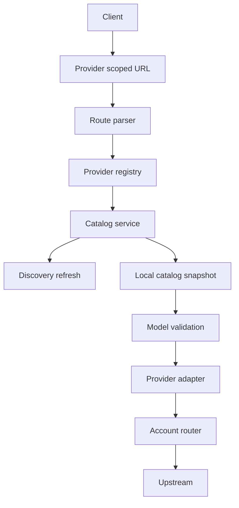

# Provider-centric LLM Agent Platform redesign spec

Status: Proposed
Owner: Architect stage
Date: 2026-03-19

## 1. Problem and goals

Текущая платформа унаследовала proxy-first и mode-by-model-name дизайн:
- публичные маршруты смешивают provider и group semantics через `/<group_id>/v1/*`;
- provider часто выбирается по имени модели;
- список моделей частично захардкожен в runtime-коде;
- suffix-подход `quota` и `vertex` кодирует транспорт и billing semantics в model id;
- документация местами описывает сервис как Gemini proxy для Google AI Pro, а не как платформу для LLM агентов.

Цель redesign:
- сделать provider центральной сущностью HTTP контракта и runtime модели;
- использовать истинные upstream model ids без suffix-семантики;
- убрать hardcoded catalogs из runtime routes;
- ввести единый provider catalog lifecycle с bootstrap, local snapshot и optional discovery refresh;
- добавить первый discovery-capable provider `openai-chatgpt` как референсную реализацию discovery path;
- сохранить groups как capability нашей платформы внутри provider namespace;
- обновить narrative проекта: это платформа для LLM агентов, а не Gemini proxy.

## 2. Non-goals

- Полная реализация нового дизайна в этом документе не выполняется.
- Повторная миграция layout не входит в scope: текущий целевой layout уже принят как `llm_agent_platform/` для runtime-кода, `scripts/` для локальных скриптов, `secrets/` для секретов и корень репозитория для infra-файлов.
- Полная переработка native Gemini endpoints вне контекста provider-centric модели не входит в текущий scope.
- Автоматическая миграция старых клиентских конфигов backward compatibility не требуется.

## 3. Use cases and user stories

### US-001 Provider explicit routing
Как пользователь платформы, я хочу явно выбирать провайдера через URL, чтобы одинаковые model ids у разных провайдеров не конфликтовали.

Acceptance criteria:
- Публичный контракт использует только provider-scoped пути.
- Provider выбирается из URL, а не из model id.
- Два провайдера могут иметь одинаковый model id без двусмысленности.

### US-002 Provider-local groups
Как администратор платформы, я хочу создавать группы аккаунтов внутри конкретного провайдера, чтобы route namespace был детерминированным.

Acceptance criteria:
- Группа существует только внутри provider namespace.
- `g1` у одного провайдера не конфликтует с `g1` у другого.
- `default group` адресуется через provider path без явного group segment.
- `default group` определяется как первая группа из provider config, а если группы не заданы — как все аккаунты провайдера.

### US-003 True model names
Как клиент OpenAI-compatible API, я хочу видеть истинные имена моделей, чтобы не зависеть от внутренних suffix-конвенций сервиса.

Acceptance criteria:
- Публичные model ids не содержат `quota` и `vertex`.
- Разные providers могут публиковать одинаковый model id.
- Provider-specific semantics описываются provider metadata, а не именем модели.

### US-004 Provider catalog without route hardcode
Как разработчик платформы, я хочу хранить каталоги моделей вне route-кода, чтобы добавление нового provider или модели не требовало правки route handler.

Acceptance criteria:
- Route layer не содержит hardcoded model lists.
- Для каждого provider есть bootstrap catalog.
- Runtime умеет читать provider-local catalog snapshot.

### US-005 Discovery refresh with resilient fallback
Как пользователь платформы, я хочу получать список моделей даже при недоступности upstream discovery, чтобы `/models` оставался стабильным.

Acceptance criteria:
- При успешном discovery локальный snapshot обновляется.
- При ошибке discovery отдается последний сохраненный snapshot.
- При отсутствии snapshot используется bootstrap catalog.

### US-006 Rebranding and product clarity
Как новый пользователь репозитория, я хочу видеть корректное описание продукта, чтобы понимать, что это LLM Agent Platform, а не узкий Gemini proxy.

Acceptance criteria:
- README и ключевые docs убирают legacy proxy-first narrative.
- Упоминания Google AI Pro и Gemini-only сценария не позиционируются как core definition продукта.
- Документация описывает платформу как provider-centric LLM platform.

### US-007 First discovery-capable provider
Как архитектор платформы, я хочу иметь хотя бы один реальный discovery-capable provider в текущем этапе, чтобы проверить `catalog snapshot` и `discovery refresh` не только теоретически, но и на рабочем provider.

Acceptance criteria:
- В scope redesign входит provider `openai-chatgpt`.
- Для него проектируется `discovery refresh` каталога моделей.
- Тестовый контур покрывает `snapshot refresh` и `fallback` на этом provider.

## 4. NFR

### NFR-001 Deterministic routing
Routing должен быть детерминированным: одинаковый запрос к одному URL всегда резолвится в один provider namespace.

### NFR-002 Catalog resilience
`GET /models` должен работать при временной недоступности discovery upstream за счет локального snapshot.

### NFR-003 Configurability
Добавление нового provider и его bootstrap catalog должно быть возможно без изменения route-кода.

### NFR-004 Auditability
Архитектурные решения по provider registry, catalog snapshot и route contract должны быть зафиксированы в канонических docs и ADR.

### NFR-005 Testability
Новый контракт должен иметь трассировку requirement -> suite -> test script и покрывать одинаковые model ids у разных providers.

## 5. Constraints

### CONS-001 Breaking change allowed
Backward compatibility для старых путей `/v1/*` и `/<group_id>/v1/*` не требуется.

### CONS-002 Public route names
Публичные provider names принимаются в kebab-case:
- `gemini-cli`
- `google-vertex`
- `qwen-code`
- `openai-chatgpt`

### CONS-003 Internal ids
Канонический `provider_id` должен совпадать с публичным `provider_name` и использовать kebab-case:
- `gemini-cli`
- `google-vertex`
- `qwen-code`
- `openai-chatgpt`

Python module names и file names могут оставаться техническими, но domain id в URL, registry, config и state должен быть единообразным.

### CONS-004 Groups are platform capability
Группы реализуются платформой и не считаются optional capability конкретного provider.

### CONS-005 Architect mode restrictions
В текущем architect stage допустимо фиксировать markdown-артефакты и план contract-first файлов; реальные schema files будут создаваться на следующем шаге.

## 6. Architecture overview

Новая модель строится вокруг трех уровней:
1. Provider routing layer
2. Provider registry and catalog layer
3. Provider runtime adapters

### External contract
Публичные маршруты:
- `/<provider_name>/v1/models`
- `/<provider_name>/v1/chat/completions`
- `/<provider_name>/<group_name>/v1/models`
- `/<provider_name>/<group_name>/v1/chat/completions`

### Core architectural shift
Старый поток:
- request model id -> infer provider -> infer group

Новый поток:
- request URL -> resolve provider -> resolve group -> validate model against provider catalog -> execute via provider adapter

### High-level flow

## 7. Domain model

### Provider
Каноническая сущность интеграции. Несет:
- public route name
- internal provider id
- auth profile
- transport profile
- bootstrap catalog
- optional discovery refresh strategy
- catalog cache policy

### Group
Логическая группа аккаунтов внутри provider namespace.

Правило `default group`:
- если группы объявлены, `default group` это первая группа в provider config;
- если группы не объявлены, `default group` состоит из всех аккаунтов provider.

### Model descriptor
Запись каталога модели внутри provider catalog.
Минимум:
- `model_id`
- `display_name`
- `capabilities`
- `lifecycle`
- optional provider-specific metadata

### Catalog snapshot
Локально сохраненный список моделей конкретного provider после успешного discovery refresh.

Пояснение:
- `bootstrap catalog` — стартовый локальный набор моделей, заданный в provider descriptor.
- для provider без discovery это основной и канонический источник каталога, без отдельного persisted snapshot;
- для provider с discovery это начальный и fallback источник до первого успешного refresh, а также safety net при проблемах discovery.

### Provider registry
Реестр провайдеров, через который route layer резолвит provider и получает descriptor.

## 8. Key models and planned contracts

### Planned contract: provider descriptor
Будущий contract file:
- `docs/contracts/config/provider-descriptor.schema.json`

Предварительные поля:
- `provider_id`
- `route_name`
- `display_name`
- `auth`
- `transport`
- `catalog.bootstrap`
- `catalog.discovery`
- `catalog.cache`

### Planned contract: provider catalog snapshot
Будущий contract file:
- `docs/contracts/state/provider-catalog-snapshot.schema.json`

Предварительные поля:
- `provider_id`
- `version`
- `as_of`
- `source`
- `models[]`

Пояснение по `as_of`:
- это момент времени, когда snapshot был сформирован и сохранен локально;
- поле нужно для диагностики свежести каталога;
- это не дата выпуска модели и не дата обновления upstream провайдера.

Важно:
- `provider catalog snapshot` нужен только для providers с `discovery refresh`;
- для static providers каталог читается напрямую из `bootstrap catalog` без persisted snapshot.

### Planned contract: provider registry config
Будущий contract file:
- `docs/contracts/config/provider-registry.schema.json`

## 9. Contracts

### Public HTTP routes
Канонический набор маршрутов:
- `GET /<provider_name>/v1/models`
- `POST /<provider_name>/v1/chat/completions`
- `GET /<provider_name>/<group_name>/v1/models`
- `POST /<provider_name>/<group_name>/v1/chat/completions`

### Provider-name mapping
Публичные и внутренние идентификаторы провайдеров должны совпадать:
- `gemini-cli`
- `google-vertex`
- `qwen-code`
- `openai-chatgpt`

### Catalog resolution contract
Порядок резолва каталога в `catalog service`:
1. взять `bootstrap catalog` из `provider descriptor` как локальный базовый каталог;
2. если provider не поддерживает `discovery refresh`, вернуть `bootstrap catalog`;
3. если provider поддерживает `discovery refresh`, прочитать последний `persisted local snapshot`, если он есть;
4. попытаться выполнить `discovery refresh`;
5. при успешном `discovery refresh` провалидировать payload и сохранить новый `snapshot`;
6. при ошибке `discovery refresh` вернуть последний валидный `snapshot`, а если его нет — вернуть `bootstrap catalog`.

Пояснение:
- для provider без discovery `bootstrap catalog` является единственным локальным каталогом;
- для provider с discovery `bootstrap catalog` нужен как стартовый и аварийный fallback.

## 10. Test design

### TC-001 Provider scoped routing
Given запрос приходит на `provider-scoped path`
When route parser обрабатывает URL
Then provider резолвится из URL, а не выводится по `model id`

### TC-002 Provider-local group namespace
Given два provider имеют одинаковый `group name`
When запросы идут в provider-specific пути
Then каждый запрос использует только свой `provider-local group state` и свой набор моделей

### TC-003 Shared model ids across providers
Given одинаковый `model id` присутствует у нескольких providers
When клиент вызывает provider-specific путь
Then используется только `provider-local model catalog`

### TC-004 Discovery fallback to snapshot
Given `discovery refresh` завершился ошибкой
When вызывается `/models`
Then сервис возвращает последний сохраненный `catalog snapshot`

### TC-005 Bootstrap fallback
Given `snapshot` отсутствует и `discovery refresh` недоступен или отключен
When вызывается `/models`
Then сервис возвращает `bootstrap catalog`

### TC-006 Legacy suffix removal
Given `provider catalog` использует истинные имена моделей
When вызывается `/models`
Then `model ids` не содержат `quota` и `vertex`

### TC-007 Rebranding docs integrity
Given обновленный набор документации
When выполняется review product narrative
Then legacy narrative про Gemini proxy удален из top-level docs и ключевых архитектурных документов

## 11. Coverage matrix

| Requirement | Test cases | Level |
|---|---|---|
| US-001 | TC-001 TC-003 | L3 |
| US-002 | TC-002 | L3 |
| US-003 | TC-003 TC-006 | L2 L3 |
| US-004 | TC-003 TC-005 | L2 |
| US-005 | TC-004 TC-005 | L2 L3 |
| US-006 | TC-007 | L1 review |
| NFR-001 | TC-001 TC-002 | L3 |
| NFR-002 | TC-004 TC-005 | L2 L3 |
| NFR-003 | TC-005 | L2 |
| NFR-004 | review of docs and ADR package | L1 |
| NFR-005 | suite and traceability update | L1 |

## 12. Risk register

| ID риска | Формулировка риска | Категория | Вероятность | Влияние | Обнаружение | Смягчение | План действий | Владелец | Статус | Ссылки |
|---|---|---|---|---|---|---|---|---|---|---|
| R-001 | Breaking change по маршрутам может оставить смешанные предположения в коде, тестах и документации | Delivery | M | H | падение route tests и наличие устаревших ссылок в docs | проводить смену маршрутов как единое согласованное изменение | держать явный migration checklist до завершения cleanup | Architect | Open | |
| R-002 | Одинаковые `model ids` у разных providers могут продолжать протекать в старую глобальную логику выбора provider | Delivery | M | H | contract tests на `provider-local model validation` | удалить вывод provider по имени модели | блокировать merge пока старый inference path не убран | Architect | Open | |
| R-003 | `discovery refresh` может перезаписать локальный `snapshot` некорректным payload | Ops | M | H | schema validation и tests на запись snapshot | валидировать результат discovery по contract before persist | откатываться к предыдущему валидному snapshot | Architect | Open | |
| R-004 | Legacy narrative в документации может остаться частично несогласованным после redesign | Delivery | M | M | grep-based review и ручной review ключевых docs | включить явный checklist по rebranding docs | считать релиз заблокированным до обновления core docs | Architect | Open | |
| R-005 | `provider registry` может начать дублировать provider data между несколькими конфигами | Delivery | M | M | review схем и config review | определить единый `contract-first provider descriptor` | поэтапно убрать route hardcode и дублированные lists | Architect | Open | |

## 13. Open questions

### OQ-001 Native Gemini endpoints future
Owner: Architect
Решение: отдельный `provider-native namespace` пока не нужен. На текущем этапе все providers целятся в OpenAI-compatible endpoint как основной публичный контракт.
Статус: Closed

### OQ-002 Catalog snapshot storage path
Owner: Architect
Решение: `catalog snapshot` хранится в `STATE_DIR` рядом с другим runtime state для discovery-capable providers.
Статус: Closed

### OQ-003 Discovery provider in current scope
Owner: Architect
Решение: в текущий этап добавляется `openai-chatgpt` как первый discovery-capable provider, чтобы `catalog snapshot` и `discovery refresh` были проверены на реальном provider path.
Статус: Closed

## 14. ADR links

Существующие связанные ADR:
- `docs/adr/0016-codebase-layout-separate-runtime-app-and-local-scripts.md`
- `docs/adr/0017-url-prefix-groups-and-group-aware-models.md`
- `docs/adr/0018-quota-reset-periods-and-account-state.md`
- `docs/adr/0019-state-dir-unified-account-state-and-async-writer.md`

Планируемые ADR:
- ADR: provider-centric routing и `provider registry`
- ADR: `provider catalog snapshot` и `discovery refresh`
- ADR: product repositioning от Gemini proxy к LLM Agent Platform

## 15. Documentation and rebranding plan

Priority docs to update:
- `README.md`
- `docs/vision.md`
- `docs/usage.md`
- `docs/auth.md`
- `docs/architecture/component-map.md`
- `docs/architecture/openai-chat-completions-pipeline.md`
- `docs/architecture/quota-account-rotation-groups-and-models.md`
- `docs/testing/test-map.md`
- `docs/testing/suites/proxy-routes.md`
- `docs/testing/suites/openai-contract.md`

Expected narrative changes:
- убрать позиционирование как Gemini proxy;
- убрать narrative про один Google аккаунт как основную цель продукта;
- описать платформу как provider-centric LLM Agent Platform;
- закрепить, что providers могут иметь одинаковые model ids;
- закрепить, что groups живут внутри provider namespace.
