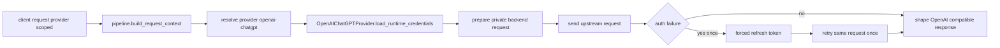

# Plan: task 016 `openai-chatgpt` runtime OAuth integration

## Scope

План покрывает реализацию [`tasks_descriptions/tasks/016-gpt-integration.md`](tasks_descriptions/tasks/016-gpt-integration.md:1) с учетом research из [`tasks_descriptions/research/2026-03-21-openai-codex-oauth-and-usage-research.md`](tasks_descriptions/research/2026-03-21-openai-codex-oauth-and-usage-research.md:1), provider канона из [`docs/providers/openai-chatgpt.md`](docs/providers/openai-chatgpt.md:1) и pipeline boundary из [`docs/architecture/openai-chat-completions-pipeline.md`](docs/architecture/openai-chat-completions-pipeline.md:1).

В scope входят:
- runtime OAuth bootstrap для `openai-chatgpt` через Authorization Code + PKCE;
- runtime adapter для приватного backend surface, а не generic public OpenAI base URL;
- интеграция `openai-chatgpt` в quota contour по модели [`qwen-code`](llm_agent_platform/provider_registry/providers/qwen-code.json:1), но с reset period раз в неделю или другим period из provider config;
- поддержка обоих режимов provider accounts-config: `single` и `rounding`, где strategy определяется конфигом провайдера, а не жестко самим adapter;
- поддержка provider-local groups через тот же общий механизм groups, который уже описан в [`docs/architecture/quota-account-rotation-groups-and-models.md`](docs/architecture/quota-account-rotation-groups-and-models.md:1);
- forced refresh retry invariant;
- normalized usage-limits adapter только как monitoring capability;
- cleanup legacy descriptor and registry semantics, чтобы provider шел от static catalog baseline, а не от discovery lifecycle.

Initial baseline catalog для `openai-chatgpt` фиксируется по правилу:
- naming style берем из reference [`externel_projects/kilocode/packages/types/src/providers/openai-codex.ts`](externel_projects/kilocode/packages/types/src/providers/openai-codex.ts:17), то есть lowercase kebab-case model ids;
- actual available model set берем из актуального списка пользователя, а не из устаревшего snapshot reference.

Вне scope:
- live discovery моделей;
- использование usage polling для quota/routing decisions;
- возврат legacy `/v1/*` маршрутов;
- изменение общих provider-agnostic contracts без явной необходимости.

## Requirements draft

### User stories

- `US-016-01` Как оператор платформы, я хочу подключить [`openai-chatgpt`](docs/providers/openai-chatgpt.md:1) как runtime provider, чтобы `POST /openai-chatgpt/v1/chat/completions` работал через provider-scoped pipeline.
- `US-016-02` Как разработчик, я хочу получать runtime OAuth credentials из persisted state, чтобы adapter мог работать без ручного вмешательства на каждый запрос.
- `US-016-03` Как оператор, я хочу чтобы [`openai-chatgpt`](docs/providers/openai-chatgpt.md:1) мог работать и в `single`, и в `rounding` режиме, чтобы один и тот же provider поддерживал direct account и quota rotation в зависимости от provider accounts-config.
- `US-016-04` Как оператор, я хочу использовать provider-local groups для [`openai-chatgpt`](docs/providers/openai-chatgpt.md:1), чтобы пул аккаунтов и доступные модели могли изолироваться по group внутри provider namespace.
- `US-016-05` Как оператор, я хочу безопасный auth recovery с одним forced refresh retry, чтобы временное истечение токена не приводило к постоянным 401 и бесконечным циклам retry.
- `US-016-06` Как оператор observability, я хочу отдельный usage adapter, который нормализует monitoring snapshot, чтобы лимиты можно было анализировать отдельно от критического request path.
- `US-016-07` Как архитектор платформы, я хочу убрать legacy discovery semantics из descriptor [`llm_agent_platform/provider_registry/providers/openai-chatgpt.json`](llm_agent_platform/provider_registry/providers/openai-chatgpt.json:1), чтобы runtime и docs использовали единый static catalog baseline.

### NFR

- `NFR-016-01` Runtime adapter не должен менять публичный OpenAI-compatible HTTP контракт, проверяемый через [`docs/testing/suites/openai-contract.md`](docs/testing/suites/openai-contract.md:1).
- `NFR-016-02` Auth recovery должна выполнять не более одного forced refresh и не должна создавать unbounded retry loop.
- `NFR-016-03` Отсутствие `account_id` в OAuth state не должно блокировать runtime запрос.
- `NFR-016-04` Usage-limits polling не должен быть обязательным условием успеха `chat/completions`.
- `NFR-016-05` Provider должен поддерживать quota reset periods через существующий contract [`model_quota_resets`](docs/contracts/config/provider-accounts-config.schema.json:36), включая weekly reset `07:00:00`.
- `NFR-016-06` Provider catalog для `openai-chatgpt` должен оставаться deterministic и static-only.

### Constraints

- `CONS-016-01` Provider выбирается только через URL namespace по канону [`docs/adr/0020-provider-centric-routing-and-provider-catalogs.md`](docs/adr/0020-provider-centric-routing-and-provider-catalogs.md:23).
- `CONS-016-02` `ChatGPT-Account-Id` остается conditional header, потому что [`account_id`](docs/contracts/state/openai-chatgpt-oauth-state.schema.json:21) best-effort optional.
- `CONS-016-03` Usage state используется только для monitoring и observability; решение о quota exhaustion принимается по реальным upstream ошибкам, как зафиксировано в [`docs/architecture/openai-chat-completions-pipeline.md`](docs/architecture/openai-chat-completions-pipeline.md:96).
- `CONS-016-04` Runtime adapter обязан инкапсулировать private backend headers и payload mapping внутри provider boundary, не протаскивая provider-specific детали в route layer.
- `CONS-016-05` Quota rotation semantics должны переиспользовать существующий router [`llm_agent_platform/services/account_router.py`](llm_agent_platform/services/account_router.py:109) и contract [`docs/contracts/config/provider-accounts-config.schema.json`](docs/contracts/config/provider-accounts-config.schema.json:1), а не вводить отдельный routing контур только для `openai-chatgpt`.
- `CONS-016-06` Provider-local groups для `openai-chatgpt` должны использовать тот же invariant disjoint groups и тот же URL contract `/<provider_name>/<group_id>/v1/*`, что и остальные providers, без provider-specific исключений.
- `CONS-016-07` Architect stage не должен расширять scope до live discovery и snapshot lifecycle для catalog.

### Closed questions

- `OQ-016-01` Cleanup descriptor semantics включен в scope этой задачи: confirmed.
- `OQ-016-02` Usage limits трактуются только как monitoring capability и не участвуют в routing/quota decisions: confirmed.
- `OQ-016-03` Catalog source of truth: provider-wide static catalog в descriptor, groups только сужают его внутри provider: confirmed.
- `OQ-016-04` Initial model ids берем в lowercase kebab-case по стилю `kilocode`, но по актуальному списку пользователя: confirmed.

## Initial baseline catalog

Для первой реализации [`openai-chatgpt`](docs/providers/openai-chatgpt.md:1) стартовый provider-wide static catalog должен включать:

- `gpt-5.4`
- `gpt-5.4-mini`
- `gpt-5.3-codex`
- `gpt-5.2-codex`
- `gpt-5.2`
- `gpt-5.1-codex-max`
- `gpt-5.1-codex-mini`

Эти model ids нужно буквально зафиксировать в descriptor [`llm_agent_platform/provider_registry/providers/openai-chatgpt.json`](llm_agent_platform/provider_registry/providers/openai-chatgpt.json:23) как initial provider-wide static catalog:

```text
gpt-5.4
gpt-5.4-mini
gpt-5.3-codex
gpt-5.2-codex
gpt-5.2
gpt-5.1-codex-max
gpt-5.1-codex-mini
```

Правило работы каталога:
- descriptor хранит provider-wide static baseline;
- provider config задает доступные provider модели и режимы работы аккаунтов;
- groups могут указывать только подмножество моделей из provider baseline и не могут расширять catalog сверх descriptor.

## Target architecture

### 1. Runtime building blocks

1. OAuth bootstrap script
   - Новый bootstrap script по аналогии с [`scripts/get_qwen-code_credentials.py`](scripts/get_qwen-code_credentials.py:1).
   - Реализует Authorization Code + PKCE flow.
   - Сохраняет normalized OAuth state по контракту [`docs/contracts/state/openai-chatgpt-oauth-state.schema.json`](docs/contracts/state/openai-chatgpt-oauth-state.schema.json:1).

2. OAuth runtime manager
   - Новый auth module для чтения persisted state, проверки expiry, refresh и forced refresh.
   - Повторно использует паттерны из [`llm_agent_platform/auth/qwen_oauth.py`](llm_agent_platform/auth/qwen_oauth.py:1), но без device-flow semantics.
   - Выдает runtime credentials для provider adapter.

3. `OpenAIChatGPTProvider`
   - Новый provider adapter в [`llm_agent_platform/api/openai/providers/`](llm_agent_platform/api/openai/providers/base.py:1).
   - Реализует [`Provider.load_runtime_credentials()`](llm_agent_platform/api/openai/providers/base.py:21), [`Provider.prepare_upstream()`](llm_agent_platform/api/openai/providers/base.py:24), [`Provider.execute_non_stream()`](llm_agent_platform/api/openai/providers/base.py:33), [`Provider.stream_lines()`](llm_agent_platform/api/openai/providers/base.py:40).
   - Использует private backend path и provider-specific headers.
   - Должен уметь работать как с одним выбранным аккаунтом, так и через quota rotation pool, если provider config переведен в `rounding`.

4. Monitoring usage adapter
   - Отдельный provider-specific adapter для чтения usage snapshot.
   - Не подключается в critical path [`POST /<provider_name>/v1/chat/completions`](docs/architecture/openai-chat-completions-pipeline.md:10).
   - Пишет normalized snapshot по контракту [`docs/contracts/state/openai-chatgpt-usage-limits.schema.json`](docs/contracts/state/openai-chatgpt-usage-limits.schema.json:1).

5. Descriptor cleanup
   - [`llm_agent_platform/provider_registry/providers/openai-chatgpt.json`](llm_agent_platform/provider_registry/providers/openai-chatgpt.json:1) переводится к static-only catalog semantics.
   - Discovery metadata и snapshot-enabled flags удаляются или перестают использоваться для этого provider.

6. Quota contour alignment
   - [`openai-chatgpt`](docs/providers/openai-chatgpt.md:1) подключается к существующему provider accounts-config contract.
   - Для `mode=single` provider работает как direct single-account flow.
   - Для `mode=rounding` provider использует router, persisted quota state и reset periods из [`docs/architecture/quota-reset-periods-and-account-state.md`](docs/architecture/quota-reset-periods-and-account-state.md:1).
   - Groups и group-local model subsets поддерживаются через общий provider-local group contract из [`docs/architecture/quota-account-rotation-groups-and-models.md`](docs/architecture/quota-account-rotation-groups-and-models.md:41).

### 2. Request flow



### 3. State boundaries

- OAuth state
  - Канонический путь берется из descriptor metadata [`llm_agent_platform/provider_registry/providers/openai-chatgpt.json`](llm_agent_platform/provider_registry/providers/openai-chatgpt.json:10).
  - Хранит `access_token`, optional `refresh_token`, optional `account_id`, `expires_at`, `obtained_at`, optional `scopes`, `metadata`.

- Usage state
  - Путь берется из [`llm_agent_platform/provider_registry/providers/openai-chatgpt.json`](llm_agent_platform/provider_registry/providers/openai-chatgpt.json:11).
  - Обновляется только по явному monitoring flow.
  - Не участвует в account rotation и не определяет exhausted state.

### 4. Pipeline integration boundary

Для минимального breaking surface предлагается:
- добавить новый provider class и зарегистрировать его в [`llm_agent_platform/api/openai/pipeline.py`](llm_agent_platform/api/openai/pipeline.py:22);
- сделать выбор strategy config-aware: `single` -> direct behavior, `rounding` -> reuse quota rotation behavior;
- расширить router/config resolution так, чтобы [`openai-chatgpt`](docs/providers/openai-chatgpt.md:1) использовал тот же accounts-config contract, что и quota providers;
- auth recovery держать внутри provider adapter, аналогично pattern в [`llm_agent_platform/api/openai/providers/qwen_code.py`](llm_agent_platform/api/openai/providers/qwen_code.py:117), но с более явной forced-refresh семантикой, conditional `account_id` и совместимостью с account selection.

## Implementation steps

### Step 1. Descriptor and config alignment
- Очистить [`llm_agent_platform/provider_registry/providers/openai-chatgpt.json`](llm_agent_platform/provider_registry/providers/openai-chatgpt.json:1) от discovery baseline.
- Добавить transport metadata для runtime backend, auth endpoints, originator, callback port и user-agent, если это реально нужно adapter layer.
- Добавить provider accounts-config path и env/config wiring для `openai-chatgpt`, чтобы provider мог работать как `single` или `rounding` по аналогии с quota contour.
- Уточнить env surface в [`llm_agent_platform/config.py`](llm_agent_platform/config.py:1) и [`.env.example`](.env.example:1).

Expected result:
- descriptor соответствует static catalog канону, а config surface допускает both single and rounding modes.

### Step 2. OAuth bootstrap and auth manager
- Создать новый bootstrap script в [`scripts/`](scripts:1) для Authorization Code + PKCE.
- Создать auth module для `openai-chatgpt` refresh/load/save semantics.
- Нормализовать expiration в `date-time` вместо epoch milliseconds.
- Реализовать best-effort extraction of `account_id` из token claims.

Expected result:
- runtime может читать и обновлять валидный OAuth state без ручной правки JSON.

### Step 3. Provider adapter
- Создать [`OpenAIChatGPTProvider`](llm_agent_platform/api/openai/providers/base.py:16).
- Реализовать payload mapping из OpenAI-compatible request в private backend payload.
- Добавить required headers и conditional `ChatGPT-Account-Id`.
- Реализовать stream and non-stream execution.
- Реализовать ровно один forced refresh retry при auth failure.
- Поддержать загрузку credentials как для active single account, так и для selected account из router pool.

Expected result:
- provider-scoped route начинает реально обслуживать `chat/completions` для `openai-chatgpt`.

### Step 4. Quota rotation integration
- Расширить [`llm_agent_platform/services/account_router.py`](llm_agent_platform/services/account_router.py:822) и связанный config/env surface для поддержки provider `openai-chatgpt`.
- Подключить provider к existing rotation strategy, когда accounts-config переведен в `rounding`.
- Зафиксировать weekly reset через `model_quota_resets.default = 07:00:00` как типовой пример, но оставить период полностью конфигурируемым.
- Поддержать groups, group-specific pools и provider-local `/models` semantics для `/<provider_name>/<group_id>/v1/*`.

Expected result:
- `openai-chatgpt` работает как direct single-account provider или как quota-rotating provider по одному и тому же provider config contract, включая provider-local groups.

### Step 5. Monitoring usage adapter
- Реализовать `ProviderUsageLimitsPort` как provider-specific adapter boundary.
- Добавить normalized mapping `primary` и `secondary` окон в [`docs/contracts/state/openai-chatgpt-usage-limits.schema.json`](docs/contracts/state/openai-chatgpt-usage-limits.schema.json:1) без участия в routing decisions.
- Сохранить provider-specific metadata в state.

Expected result:
- usage snapshot доступен для monitoring, но отказ usage endpoint не ломает runtime requests.

### Step 6. Tests and docs sync
- Добавить отдельные runtime tests для `openai-chatgpt` provider.
- Добавить coverage для single mode и rounding mode, включая weekly reset semantics и account rotation behavior.
- Добавить coverage для groups isolation и group-local models behavior.
- Обновить [`docs/testing/test-map.md`](docs/testing/test-map.md:1) и relevant suite pages.
- Синхронизировать [`docs/providers/openai-chatgpt.md`](docs/providers/openai-chatgpt.md:1), [`docs/auth.md`](docs/auth.md:1), [`docs/configuration/env-files.md`](docs/configuration/env-files.md:1).
- При необходимости зафиксировать ADR update или follow-up ADR, если descriptor cleanup меняет contract boundary.

Expected result:
- docs и test traceability соответствуют реальному runtime behavior.

## Proposed code touch points

### Runtime
- [`llm_agent_platform/api/openai/pipeline.py`](llm_agent_platform/api/openai/pipeline.py:22)
- [`llm_agent_platform/api/openai/providers/base.py`](llm_agent_platform/api/openai/providers/base.py:16)
- Новый provider file в [`llm_agent_platform/api/openai/providers/`](llm_agent_platform/api/openai/providers/base.py:1)
- Новый auth module в [`llm_agent_platform/auth/`](llm_agent_platform/auth/qwen_oauth.py:1)
- [`llm_agent_platform/provider_registry/providers/openai-chatgpt.json`](llm_agent_platform/provider_registry/providers/openai-chatgpt.json:1)
- [`llm_agent_platform/config.py`](llm_agent_platform/config.py:1)
- [`llm_agent_platform/services/account_router.py`](llm_agent_platform/services/account_router.py:822)

### Bootstrap and docs
- Новый script в [`scripts/`](scripts:1)
- [`.env.example`](.env.example:1)
- [`docs/providers/openai-chatgpt.md`](docs/providers/openai-chatgpt.md:1)
- [`docs/auth.md`](docs/auth.md:1)
- [`docs/configuration/env-files.md`](docs/configuration/env-files.md:1)
- [`docs/testing/test-map.md`](docs/testing/test-map.md:1)

### Tests
- Новый runtime suite file в [`llm_agent_platform/tests/`](llm_agent_platform/tests/test_openai_contract.py:1)
- Возможное расширение [`llm_agent_platform/tests/test_openai_contract.py`](llm_agent_platform/tests/test_openai_contract.py:1)
- Возможное расширение [`llm_agent_platform/tests/test_provider_catalogs.py`](llm_agent_platform/tests/test_provider_catalogs.py:1)

## Verification matrix

- OAuth bootstrap state file creation and refresh path
- Non-stream `chat/completions` success path
- Stream `chat/completions` success path
- Missing optional `account_id` does not break runtime request
- One forced refresh retry on first auth failure
- Refresh failure surfaces as bounded auth error
- Single mode works without quota rotation
- Rounding mode rotates accounts and respects `model_quota_resets` weekly period semantics
- Provider-local groups isolate account pools and model visibility correctly
- Static catalog remains source of truth for `/models`
- Usage adapter writes normalized monitoring snapshot but is not required for request success
- Descriptor no longer advertises discovery/snapshot lifecycle for `openai-chatgpt`

## Risks and mitigations

- Risk: private backend payload differs materially from current OpenAI-compatible payload.
  - Mitigation: adapter keeps dedicated payload mapping and tests against canned upstream fixtures.

- Risk: auth refresh invalidates state unexpectedly.
  - Mitigation: isolate refresh manager, validate likely invalid grant behavior, keep retry bounded to one attempt.

- Risk: descriptor cleanup accidentally breaks registry assumptions.
  - Mitigation: добавить regression tests на [`GET /openai-chatgpt/v1/models`](docs/providers/openai-chatgpt.md:14) и catalog loading.

- Risk: usage monitoring starts leaking into routing decisions.
  - Mitigation: явная граница в docs и tests, что exhausted определяется только по upstream runtime errors.

- Risk: provider strategy selection останется привязанной к adapter id и не позволит конфигом переключать `single` и `rounding`.
  - Mitigation: вынести strategy resolution на уровень provider config capability, а не hardcoded membership set.

## Handoff for implementation mode

Исполнителю в режиме code нужно работать в таком порядке:
1. descriptor and config cleanup;
2. OAuth bootstrap + auth manager;
3. provider adapter registration and runtime execution;
4. quota contour integration for single and rounding modes;
5. monitoring usage adapter;
6. tests;
7. docs sync.

## Approval checkpoint

Рекомендованный baseline для реализации:
- static catalog only;
- runtime adapter через private backend;
- provider config decides `single` vs `rounding` behavior;
- quota exhaustion reset period для typical config может быть weekly `07:00:00`;
- provider-local groups поддерживаются теми же общими механиками, что и у остальных providers;
- `account_id` optional;
- forced refresh retry exactly once;
- usage polling only for monitoring;
- descriptor cleanup включен в тот же task scope.
