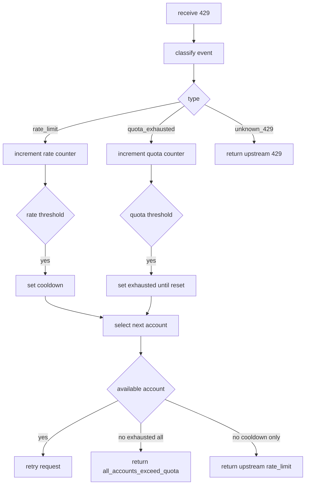

# План унификации 429 для quota rotation gemini и qwen

## 1. Цель
Разделить обработку `429` по смыслу и унифицировать поведение в stream и non-stream:
- `rate_limit` превышение частоты, аккаунт не исчерпан
- `quota_exhausted` дневная квота модели на аккаунте исчерпана
- корректный ответ `all_accounts_exceed_quota`, только когда для текущей модели исчерпаны все аккаунты

## 2. Подтвержденные правила
- Порог переключения по `rate_limit` равен `2`
- Порог пометки `quota_exhausted` равен `2`
- `rate_limit` cooldown равен `5` секунд
- Время сброса квот задается в provider config отдельно для каждой модели в TZ Asia Vladivostok

## 3. Архитектурный дизайн

### 3.1 Классификатор 429
Ввести единый классификатор в transport-слое:
- `RATE_LIMIT`
- `QUOTA_EXHAUSTED`
- `UNKNOWN_429`

Источники входа классификатора:
- HTTP статус и body
- SSE payload с `error`
- stream exception вида `429:...`

Требование:
оба маршрута [`api/openai/routes.py`](../api/openai/routes.py) и [`api/gemini/routes.py`](../api/gemini/routes.py) используют единый классификатор, без локальных ad-hoc проверок.

### 3.2 State model роутера
Расширить state в [`services/account_router.py`](../services/account_router.py):
- отдельные счетчики на аккаунт
  - `consecutive_rate_limit_errors`
  - `consecutive_quota_exhausted_errors`
- `cooldown_until` для rate-limit на аккаунт
- `quota_exhausted_until` для пары provider + model + account

Политика выбора аккаунта в rounding:
1. Пропускать аккаунты в активном cooldown
2. Пропускать аккаунты с активным `quota_exhausted_until` по текущей модели
3. Если доступен аккаунт, выбрать следующий round-robin
4. Если все exhausted по модели, вернуть `all_accounts_exceed_quota`
5. Если exhausted нет, но все в cooldown, вернуть upstream rate-limit

### 3.3 Конфиг provider accounts
Расширить JSON schema provider-config:
- `rotation_policy`:
  - `rate_limit_threshold`
  - `quota_exhausted_threshold`
  - `rate_limit_cooldown_seconds`
- `model_quota_resets`:
  - ключ модель
  - значение локальное время сброса по Asia Vladivostok

Пример концепта:
```json
{
  "rotation_policy": {
    "rate_limit_threshold": 2,
    "quota_exhausted_threshold": 2,
    "rate_limit_cooldown_seconds": 5
  },
  "model_quota_resets": {
    "gemini-3-flash-preview": "10:00",
    "gemini-2.5-pro": "00:00",
    "qwen-coder-model": "08:00"
  }
}
```

### 3.4 Контракт ошибок наружу
- `quota_exhausted` всех аккаунтов по текущей модели
  - вернуть `all_accounts_exceed_quota` код `429`
- все аккаунты только во временном cooldown
  - вернуть upstream rate-limit в openai-error форме
- `UNKNOWN_429`
  - не помечать exhausted
  - обрабатывать как upstream error с кодом `429`

## 4. Изменения по файлам

### 4.1 Код
- [`services/quota_transport.py`](../services/quota_transport.py)
  - единый классификатор `429`
  - helper для HTTP SSE exception входов
- [`services/account_router.py`](../services/account_router.py)
  - новый state
  - policy переходов и reset логика
- [`api/openai/routes.py`](../api/openai/routes.py)
  - убрать локальные ветки `startswith 429`
  - перейти на унифицированный policy path
- [`api/gemini/routes.py`](../api/gemini/routes.py)
  - перейти на тот же policy path
- [`config.py`](../config.py)
  - defaults для новых policy параметров

### 4.2 Документация
- [`docs/usage.md`](../docs/usage.md)
- [`docs/auth.md`](../docs/auth.md)
- [`docs/examples/gemini_accounts_config.example.json`](../docs/examples/gemini_accounts_config.example.json)
- [`docs/examples/qwen_accounts_config.example.json`](../docs/examples/qwen_accounts_config.example.json)
- [`docs/testing/suites/quota-account-rotation.md`](../docs/testing/suites/quota-account-rotation.md)

### 4.3 Тесты
- [`tests/test_quota_account_router.py`](../tests/test_quota_account_router.py)
  - разделение rate-limit и quota-exhausted
  - cooldown поведение
  - exhausted until reset
- [`tests/test_openai_contract.py`](../tests/test_openai_contract.py)
  - stream non-stream parity для обеих категорий 429
  - проверка all_accounts_exceed_quota только для exhausted сценария
- добавить тесты классификатора в transport слое
  - новый файл `tests/test_quota_429_classification.py`

## 5. Проверка и приемка

### L1 Unit
- классификатор 429
- state transitions роутера

### L2 Route contract
- openai stream non-stream сценарии

### L3 Regression
- текущий quota rotation не ломается для gemini и qwen

## 6. Mermaid схема


## 7. Готовность к реализации
План согласован, можно переходить в режим реализации после подтверждения переключения в `code`.
